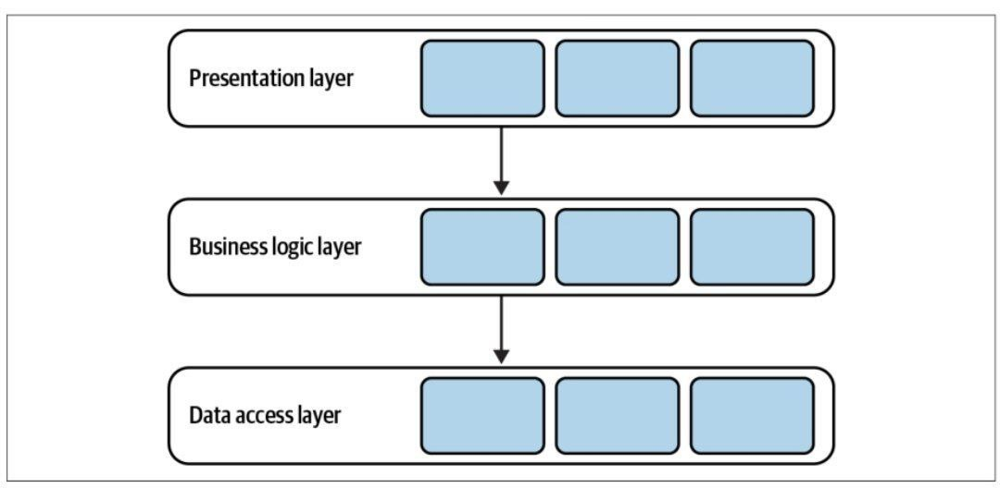
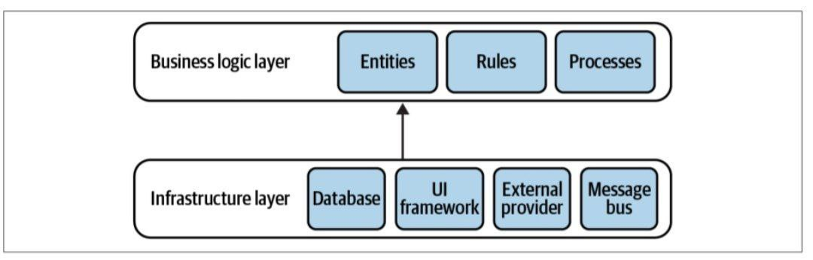
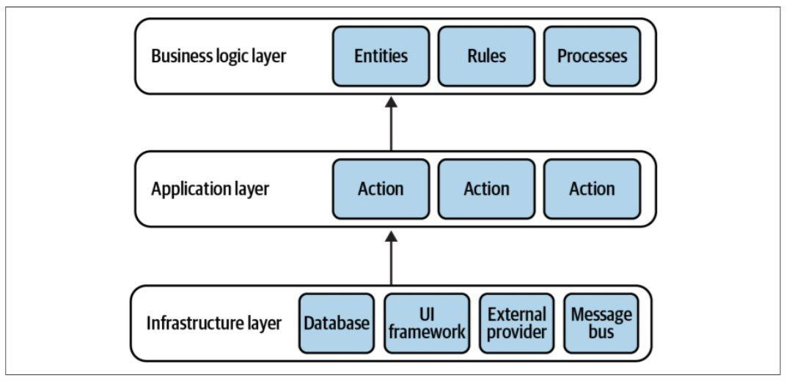
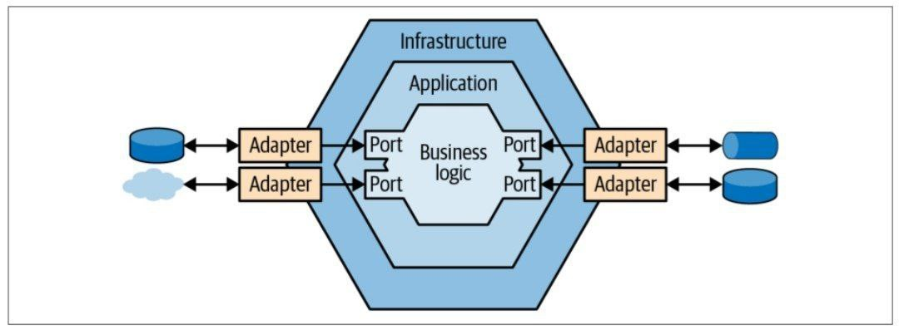
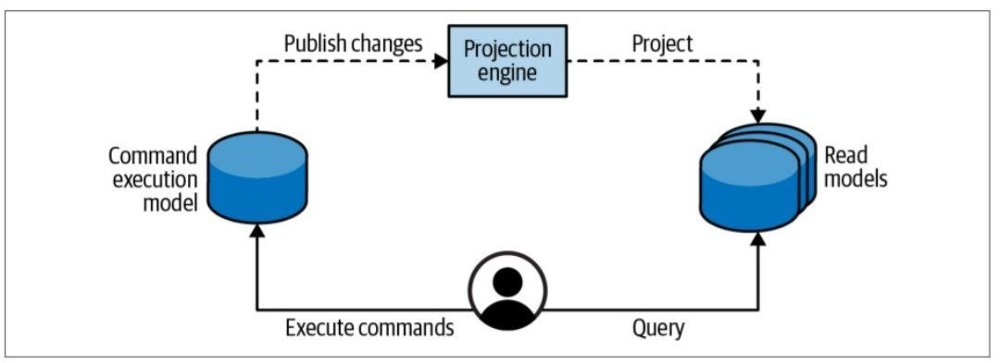
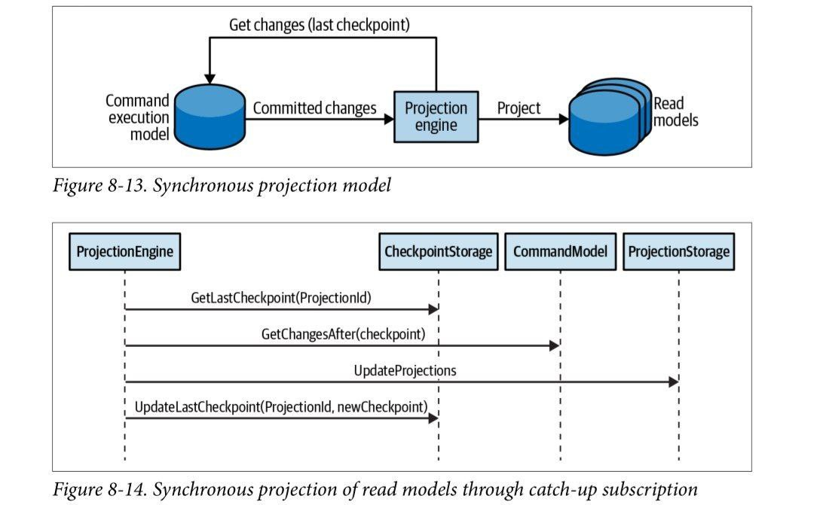
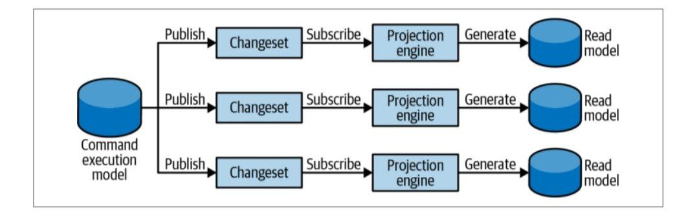
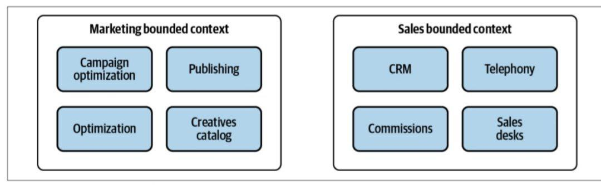
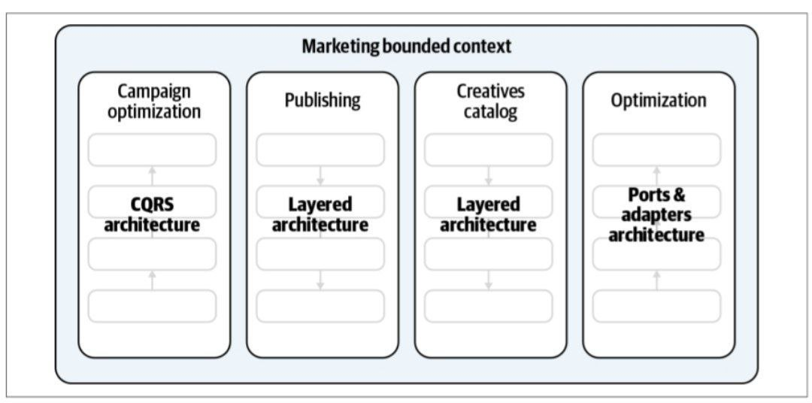

الگوهای تاکتیکی که تا اینجا مورد بحث قرار گرفت،(راه‌های مختلف مدل‌سازی و پیاده‌سازی منطق تجاری بود) در این فصل، در یک زمینه گسترده راه های مختلف برای هماهنگ کردن تعاملات و وابستگی ها بین اجزای یک سیستم را بررسی خواهیم کرد

# منطق تجاری در مقابل الگوهای طراحی:
منطق تجاری بخش مهمی از یک سیستم است اما همه آن نیست، برای اجرای الزامات کاربردی و غیر کاربردی پایگاه کد مسئولیتهای بیشتری را برعهده بگیرد. برای جمع‌آوری ورودی و ارائه خروجی باید با کاربران تعامل داشته باشد و باید از مکانیسم‌های ذخیره‌سازی مختلف برای تداوم وضعیت و ادغام با سیستم‌های خارجی و ارائه‌دهندگان اطلاعات استفاده کند. نگرانی‌های متنوع یک پایگاه کد منجر میشود که منطق تجاری در بین اجزای یک سیستم منتشر شود(در پایگاه داده، رابط کاربری یا حتی کپی کردن آن در بخش‌های مختلف) عدم سازماندهی کردن نگرانی‌های پیاده سازی، کار را در پایگاه کد سختتر میکند برای مثال هنگام تغییر منطق تجاری ممکن است مشخص نباشد دقیق کجا باید تغییر کند یا هنگام تغییر ممکن است جاهای مختلفی از کار بیافتد یا منجر به از دست رفتن کدهایی شود که نیاز به اصلاح داشتند. الگوهای معماری اصول سازمانی را برای جنبه‌های مختلف یک پایگاه کد معرفی می‌کنند و مرزهای واضحی را بین آنها ارائه می‌کنند: اینکه منطق تجاری چگونه به ورودی، خروجی و سایر اجزای زیرساختی سیستم متصل می‌شود که بر نحوه تعامل آنها اینکه چه دانشی را به اشتراک می‌گذارند و چگونه مولفه‌ها به یکدیگر ارجاع می‌کنند تاثیر می‌گذارد. انتخاب روش مناسب جهت سازماندهی پایگاه کد، یا الگوریتم معماری صحیح، برای حمایت از اجرای منطق تجاری در کوتاه مدت و کاهش تعمیر و نگهداری در بلند مدت بسیار مهم است. سه الگوی معماری کاربردی غالب شامل: معماری لایه‌ای، پورت‌ها و آداپتورها، CQRS رو باهم بررسی کنیم

# معماری لایه‌ای:
یکی از رایجترین الگوهای معماری می‌باشد که پایکاه کد را در لایه‌های افقی سازماندهی می‌کند و هر لایه به یکی از نگرانی‌های فنی زیر می‌پردازد که شامل: تعامل با مصرف کنندگان(presentation layer)، منطق تجاری(business logic)، تداوم داده‌ها(data access layer) 

لایه تعامل که شامل رابط‌های ارتباطی است که می‌تواند gui,cli,restapi,webui باشد-لایه منطق تجاری که بصورت کپسوله شده است(قلب نرم افزار) الگوها و تصمیمات تجاری  در آن است- لایه داده که شامل پایگاه داده است که شکل‌های مختلفی از قبیل پایگاه‌های sql,nosql در شکل های مختلفی از حافظه یا حتی اسناد و داکیومنت مانند باشد. ارتباط این لایه ها باهمدیگه از طریق یک کانال مستقیم از بالا به پایین و ترتیبی است بگونه‌ای که لایه تعامل هیچ درک و خبری از لایه تداوم داده ندارد

در معماری لایه‌ای مشاهده یک لایه اضافه معمول است
# لایه سرویس:
 لایه سرویس مرز یک برنامه را با لایه ای از خدمات تعریف می کند که مجموعه ای از عملیات موجود را ایجاد می کند و پاسخ برنامه را در هر عملیات هماهنگ می کند.( لایه سرویس به عنوان یک واسطه بین لایه های ارائه برنامه و منطق تجاری عمل می کند)

لایه سرویس در واقع یک مرز منطقی است نه یک سرویس فیزیکی، بعنوان یک نما برای منطق تجاری شناخته میشود که مرز لایه تعامل با منطق تجاری رو جدا میکنه،

### داشتن یک لایه سرویس واضح چندین مزیت دارد:
 • ما می توانیم از همان لایه سرویس برای سرویس دهی چندین رابط عمومی استفاده مجدد کنیم.
  • با جمع آوری تمام روش های مرتبط در یک مکان، ماژولار بودن را بهبود می بخشد.
  • لایه های ارائه و منطق تجاری را بیشتر جدا می کند.
  • آزمایش عملکرد کسب و کار را آسان تر می کند.

یک لایه سرویس همیشه ضروری نیست. به عنوان مثال، زمانی که منطق کسب و کار به عنوان یک اسکریپت تراکنش پیاده‌سازی می‌شود، اساساً یک لایه سرویس است، زیرا قبلاً مجموعه‌ای از روش‌ها را که رابط عمومی سیستم را تشکیل می‌دهند، نشان می‌دهد

 از سوی دیگر، اگر الگوی منطق تجاری نیاز به هماهنگی خارجی داشته باشد، لایه سرویس مورد نیاز است، همانطور که در مورد الگوی رکورد فعال وجود دارد. در این مورد، لایه سرویس الگوی اسکریپت تراکنش را پیاده‌سازی می‌کند، در حالی که رکوردهای فعالی که روی آن‌ها کار می‌کند در لایه منطق تجاری قرار دارند.
### این مورد رو در ذهنتون نگه دارید:
همانگونه که استفاده از الگوهای طراحی بستگی به بزرگی و میزان پیچیدگی دارد، استفاده از لایه سرویس هم بستگی به الگوی طراحی مورد استفاده شده شما در سیستم دارد
اصطلاحات بکار برده شده

### اصطلاحات دیگری که در معماری لایه‌ای استفاده می‌شوند:
 • لایه ارائه = لایه رابط کاربر
  • لایه سرویس = لایه برنامه
  • لایه منطق تجاری = لایه دامنه = لایه مدل
  • لایه دسترسی به داده = لایه زیرساخت

این الگو اجرای یک مدل دامنه را چالش برانگیز می کند. در یک مدل دامنه، نهادهای تجاری (تجمیع‌ها و اشیاء ارزشی) نباید هیچ وابستگی و دانشی از زیرساخت های اساسی داشته باشند. وابستگی معماری لایه‌ای از بالا به پایین مستلزم پریدن از میان حلقه‌ها برای برآورده کردن این نیاز است.  هنوز هم می توان یک مدل دامنه را در یک معماری لایه ای پیاده سازی کرد

درک این نکته مهم است که معماری لایه‌ای با معماری N-Tier متفاوت است و این دو بر خلاف تصور همگانی یکی نیستند.

معماری لایه‌ای تفکیک بر اساس مرز منطقی و وظایف برنامه است، اما معماری N-Tier تفکیک بر اساس لایه‌های فیزیکی و امکان مقیاس پذیری و استقرار و نگهداری هر سرویس به شکل جداگانه و توزیع شده است

# معماری پورت‌ها و آداپتورها:
این معماری بسیار شبیه به معماری لایه‌ای است و پیاده سازی آن ساده است و مناسب‌تر برای منطق‌های تجاری پیچیده است، هر دو لایه ارائه و لایه دسترسی به داده ادغام با مولفه‌های خارجی را نشان می‌دهند: پایگاه داده، خدمات خارجی و چارچوب رابط کاربری این جزییات پیاده سازی منطق تجاری سیستم را منعکس نمی‌کند، پس بیایید تمامی این نگرانی‌های زیرساختی را در یک لایه زیرساختی infrastructure layer یکی کنیم

# اصل وارونگی وابستگی DIP:
### این اصل بیان میکند که ماژولهای سطح بالا که منطق تجاری رو پیاده سازی میکنند نباید به ماژول‌های سطح پایین وابسته باشند(این همان اتفاق ناگواریست که در معماری لایه‌ای به دلیل اصل بالا به پایین رخ میداد به تصویر پست قبلی مجدد نگاه کنید) بیایید رابط را معکوس کنیم 

### در این معماری اکنون منطق تجاری نقش اصلی را برعهده گرفته و نگرانی‌های تکنولوژی حذف شده، با افزودن لایه ارائه به آن تعامل در سیستم برقرار میگردد

### این معماری الگوی پورت‌ها و آداپتورها است، منطق تجاری به لایه‌های زیرین وابستگی ندارد، همانطور که برای پیاده سازی مدل دامنه و الگوهای مدل دامنه منبع رویداد لازم است

### دلیل نام گذاری و نحوه یکپارچگی منطق تجاری با اجزای زیرساختی را میبیند

این معماری به عنوان معماری شش ضلعی، معماری پیاز و معماری تمیز نیز شناخته می شود. تمامی این الگوها بر اساس اصول طراحی یکسانی هستند، اجزای یکسانی دارند و روابط یکسانی بین آنها برقرار است، اما در مورد معماری لایه ای، 
### اصطلاحات ممکن است متفاوت باشد:
 • لایه کاربردی = لایه سرویس = لایه مورد استفاده
  • لایه منطق تجاری = لایه دامنه = لایه اصلی

با وجود این، این الگوها به اشتباه می توانند از نظر مفهومی متفاوت تلقی شوند. این فقط نمونه دیگری از اهمیت یک زبان فراگیر است. جداسازی منطق تجاری از همه نگرانی‌های تکنولوژیکی، معماری پورت‌ها و آداپتورها را مناسب برای منطق تجاری پیاده‌سازی شده با الگوی مدل دامنه می‌سازد.

# تفکیک مسئولیت فرمان پرس و جوCQRS:
الگوی (CQRS) بر اساس همان اصول سازمانی برای منطق تجاری و نگرانی های زیرساختی مانند پورت ها و آداپتورها است.با این حال، در نحوه مدیریت داده های سیستم متفاوت است. این الگو نمایش داده های سیستم را در چندین مدل پایدار امکان پذیر می کند.

# مدلسازی چندزبانه:
در بسیاری از موارد یک مدل واحد از حوزه تجاری سیستم، برای رفع تمام نیازهای سیستم دشوار باشد برای مثال: پردازش تراکنش آنلاین OLTP و پردازش تحلیلی آنلاین OLAP به نمایش متفاوتی از داده‌های سیستم نیاز دارد.
دلیل دیگر کار با چندین مدل ممکن است به مفهوم تداوم چندزبانه مربوط باشد(هیچ‌پایگاه داده‌ای کامل نیست و هرکدام به روش خود ناقص هستند) ما باید بین پرس و جو، سازگاری و مقیاس تعادل برقرار کنیم. یک راهکار برای یافتن یک پایگاه داده کامل، مدل تداوم چند زبانه است(استفاده از پایگاه‌های اطلاعاتی متعدد برای پیاده‌سازی نیازمندی‌های مرتبط با داده‌های مختلف است)

الگوی CQRS ارتباط نزدیکی با منبع رویداد دارد. در ابتدا، CQRS برای رسیدگی به امکانات محدود پرس و جو یک مدل منبع رویداد تعریف شد: فقط امکان پرس و جو از رویدادهای یک نمونه انبوه در یک زمان وجود دارد. الگوی CQRS امکان تحقق مدل‌های پیش‌بینی‌شده را در پایگاه‌های داده فیزیکی فراهم می‌کند که می‌توانند برای گزینه‌های جستجوی انعطاف‌پذیر استفاده شوند. با این حال، این بخش CQRS را از منبع رویداد جدا می کند.حتی اگر منطق تجاری با استفاده از هر یک از الگوهای پیاده سازی منطق تجاری دیگر پیاده سازی شود،CQRS مفید است

# پیاده‌سازی:
این الگو مسئولیت‌ مدل‌های سیستم را تفکیک می‌کند. دو نوع مدل وجود دارد:مدل اجرای دستور و مدل های خواندن.
اجرای دستور: CQRS یک مدل واحد را به اجرای عملیاتی اختصاص میدهد که وضعیت سیستم را تغییر میدهد (فرمان های سیستم)  این مدل برای پیاده‌سازی منطق تجاری، اعتبارسنجی و اجرای متغیرها استفاده می‌شود

مدل اجرای دستور تنها مدلی است که داده‌های کاملاً سازگار را نشان می‌دهد(منبع حقیقت سیستم) خواندن وضعیت کاملاً منسجم یک واحد تجاری و پشتیبانی همزمان خوش بینانه هنگام به روز رسانی آن باید امکان پذیر باشد.

# مدل‌های خواندنی (پیش‌بینی):
سیستم می‌تواند هر تعداد مدل را برای ارائه داده به کاربران یا ارائه اطلاعات به سیستم‌های دیگر تعریف کند. یک مدل خوانده شده یک پیش بینی، پیش کش است. این می تواند در یک پایگاه داده بادوام، فایل مسطح یا کش درون حافظه قرار گیرد. اجرای صحیح CQRS امکان پاک کردن تمام داده های یک طرح ریزی و بازسازی آن را از ابتدا فراهم می کند. همچنین امکان گسترش سیستم با پیش بینی های اضافی در آینده را فراهم می کند(مدل هایی که در ابتدا نمی توانستند پیش بینی شوند). مدل‌های خواندنی فقط خواندنی هستند. هیچ یک از عملیات سیستم نمی تواند مستقیماً داده های مدل های خوانده شده را تغییر دهد.

# طرح‌ریزی مدل‌های خوانده‌شده:
برای اینکه مدل‌های خوانده‌شده کار کنند، سیستم باید تغییرات را از مدل اجرای دستور به همه مدل‌های خوانده شده خود پیش‌بینی کند 

 هرگاه جداول منبع بروزرسانی شوند باید در نماهای پیش کش منعکس شود. دو روش برای تولید پیش بینی‌ها:همزمان و ناهمزمان

# پیش بینی های همزمان:
پیش بینی های همزمان تغییرات را در داده های OLTP از طریق مدل اشتراک تکمیلی واکشی می کنند:
  • موتور طرح ریزی پایگاه داده OLTP را برای سوابق اضافه یا به روز شده پس از آخرین نقطه بازرسی پردازش شده جستجو می کند.
  • موتور پروژکتور از داده های به روز شده برای بازسازی/به روز رسانی مدل های خوانده شده سیستم استفاده می کند.
  • موتور پروژکتور نقطه بازرسی آخرین رکورد پردازش شده را ذخیره می کند.  این مقدار در تکرار بعدی برای افزودن یا اصلاح رکوردها پس از آخرین رکورد پردازش شده استفاده خواهد شد.
این فرآیند در شکل 8-13 و به صورت نمودار توالی در شکل 8-14 نشان داده شده است

# پیش‌بینی‌های ناهمزمان:
در سناریوی پیش‌بینی ناهمزمان، مدل اجرای دستور همه تغییرات متعهد را در یک گذرگاه پیام منتشر می‌کند. موتورهای پروجکشن سیستم می توانند در پیام های منتشر شده مشترک شوند و از آنها برای به روز رسانی مدل های خوانده شده استفاده کنند.

 
علیرغم مزایای مقیاس‌گذاری و عملکرد آشکار روش پیش‌بینی ناهمزمان، این روش بیشتر مستعد چالش‌های محاسبات توزیع‌شده است. اگر پیام‌ها نامرتب یا تکراری پردازش شوند، داده‌های متناقض در مدل‌های خوانده شده نمایش داده می‌شوند. این روش همچنین افزودن پیش بینی های جدید یا بازسازی پیش بینی های موجود را چالش برانگیزتر می کند. به این دلایل، توصیه می شود همیشه طرح ریزی همزمان و به صورت اختیاری، یک طرح غیرهمزمان اضافی در بالای آن اجرا شود

# تفکیک مدل در معماری CQRS:
مسئولیت های مدل های سیستم بر اساس نوع آنها تفکیک می شود. یک فرمان فقط می تواند بر روی مدل اجرای دستور به شدت سازگار عمل کند. یک پرس و جو نمی تواند مستقیماً هیچ یک از حالت های پایدار سیستم را تغییر دهد(نه مدل های خوانده شده و نه مدل اجرای دستور) یک تصور غلط رایج در مورد سیستم های مبتنی بر CQRS این است که یک فرمان فقط می تواند داده ها را تغییر دهد و داده ها را می توان برای نمایش فقط از طریق یک مدل خواندنی واکشی کرد.به عبارت دیگر، دستور اجرای متدها هرگز نباید هیچ داده ای را برگرداند، این اشتباه است. این رویکرد پیچیدگی های تصادفی ایجاد می کند و منجر به تجربه کاربری بدی می شود. یک فرمان همیشه باید به تماس گیرنده اطلاع دهد که آیا موفق بوده یا ناموفق. اگر شکست خورده است، چرا شکست خورده است؟ آیا اعتبار یا مشکل فنی وجود داشت؟ تماس گیرنده باید بداند که چگونه دستور را برطرف کند. بنابراین، یک فرمان می تواند(در بسیاری از موارد باید) داده ها را برگرداند. برای مثال: اگر رابط کاربری سیستم باید تغییرات حاصل از دستور را منعکس کند. این نه تنها کار کردن با سیستم را برای مشتریان آسان‌تر می‌کند، منجر میشود بلافاصله بازخورد اقدامات خود را دریافت کنند، و مقادیر برگشتی را می‌توان بیشتر در جریان کاری مصرف‌کنندگان مورد استفاده قرار داد و نیاز به رفت و برگشت داده‌های غیرضروری را از بین می‌برد. تنها محدودیت در اینجا این است که داده‌های برگشتی باید از مدل کاملاً سازگار یا مدل اجرای دستور منشأ بگیرند، زیرا نمی‌توانیم انتظار داشته باشیم که پیش‌بینی‌ها، که در نهایت سازگار خواهند بود، فوراً به‌روزرسانی شوند.

# زمان استفاده از CQRS:
الگوی CQRS می‌تواند برای برنامه‌هایی مفید باشد که نیاز به کار با داده‌های یکسان در مدل‌های متعدد دارند که احتمالاً در انواع مختلف پایگاه‌های داده ذخیره می‌شوند.  از منظر عملیاتی، این الگو از ارزش اصلی طراحی دامنه محور یعنی کار با موثرترین مدل ها برای کار در دست، و بهبود مستمر مدل حوزه کسب و کار پشتیبانی می کند.  از منظر زیرساختی، CQRS امکان استفاده از قدرت انواع مختلف پایگاه‌های داده را فراهم می‌کند.  برای مثال، استفاده از یک پایگاه داده رابطه‌ای برای ذخیره‌سازی مدل اجرای دستور، یک فهرست جستجو برای جستجوی متن کامل، و فایل‌های مسطح از پیش اجرا شده برای بازیابی سریع داده‌ها، با همه مکانیسم‌های ذخیره‌سازی به طور قابل اعتماد همگام‌سازی شده‌اند.

علاوه بر این، CQRS به طور طبیعی خود را به مدل های دامنه منبع رویداد (وام/قرض) می دهد. مدل منبع رویداد امکان پرس‌وجو از رکوردها را بر اساس وضعیت‌های تجمیع‌ها غیرممکن می‌کند، اما CQRS این کار را با نمایش وضعیت‌ها در پایگاه‌های داده قابل پرسش امکان‌پذیر می‌کند.

# محدوده scope:
دامنه الگوهایی که در مورد آنها بحث کردیم(معماری لایه‌ای، معماری پورت‌ها و آداپتورها و CQRS ) نباید به عنوان اصول سازمانی در سراسر سیستم تلقی شوند. اینها لزوماً الگوهای معماری سطح بالا برای یک بافت محدود نیز نیستند. 

یک بافت محدود شامل چندین زیر دامنه را در نظر بگیرید. زیر دامنه ها می توانند انواع مختلفی داشته باشند: هسته ای، پشتیبانی کننده یا عمومی.
حتی زیر دامنه‌های هم نوع ممکن است به منطق تجاری و الگوهای معماری متفاوتی نیاز داشته باشند. اجرای یک معماری منفرد، محدود و گسترده، به طور ناخواسته منجر به پیچیدگی تصادفی خواهد شد. بافت‌های محدودی که چندین زیر دامنه را در بر می گیرد هدف ما هدایت تصمیمات طراحی بر اساس نیازهای واقعی و استراتژی تجاری است.  علاوه بر لایه هایی که سیستم را به صورت افقی پارتیشن بندی می کنند، می توانیم پارتیشن بندی عمودی اضافی را معرفی کنیم. 

 تعیین مرزهای منطقی برای ماژول هایی که زیر دامنه های تجاری متمایز را در خود محصور می کنند و استفاده از ابزارهای مناسب برای هر کدام بسیار مهم است. مرزهای عمودی مناسب یک بافت محدود یکپارچه را مدولار می کند و به جلوگیری از تبدیل شدن آن به یک توپ بزرگ از گل کمک می کند. این مرزهای منطقی را می توان بعداً به مرزهای فیزیکی بافت های مرزی با دانه بندی ریزتر تبدیل کرد.

[نویسنده: بهزاد آزادی](https://github.com/behzad-azadi2693)

[وب سایت](https://codecrafters.ir)

[کانال تلگرامی](https://t.me/Code_Crafters)

