

الگوهای طراحی تاکتیکی راه‌های مختلف پیاده‌سازی اجزای یک سیستم را تعریف می‌کند: (نحوه مدل‌سازی منطق کسب‌وکار و نحوه سازمان‌دهی داخلی یک بافت محدود از نظر معماری) در ادامه، ما از مرزهای یک جزء فراتر می رویم و الگوهای سازماندهی جریان ارتباطات در بین عناصر یک سیستم را مورد بحث قرار می دهیم. الگوهایی که ارتباطات بافتی متقابل را تسهیل می‌کنند، به محدودیت‌های تحمیل‌شده توسط اصول طراحی تجمیع می‌پردازند، و فرآیندهای کسب‌وکار را که شامل اجزای سیستم متعددی می‌شوند، هماهنگ می‌کنند.

ترجمه مدل یک بافت محدود، مرز مدل یک زبان فراگیر است، الگوهای مختلفی رو برای طراحی ارتباطات در بافت‌های محدود مختلفی یاد گرفتیم جهت یادآوری: در دو بافت محدود (ادغام سازی، اشتراک هسته) و در یک رابطه مشتری-تامین‌کننده با ترجمه مدلهای بافت محدود ارتباط را تسهیل کرد(ترجمه توسط بافت محدود پایین دست -مصرف کننده- بوسیله لایه ضد فساد ACL یا ترجمه توسط بافت محدود بالادست-تامین کننده- بوسیله میزبان باز OHS)

منطق ترجمه مدل میتواند بدون حالت یا با حالت باشد ترجمه بدون حالت مانند OHS/ACL صادر می‌شود، در حالیکه ترجمه حالت دار شامل نطق ترجمه پیچیده تری است که به پایگاه داده نیاز دارد

# ترجمه مدل بدون حالت(بی تابعیت):
بافت محدودی که ترجمه را در اختیار دارد (OHS برای بالادست، ACL برای پایین‌دست) الگوی طراحی پراکسی را برای مداخله درخواست‌های ورودی و خروجی و ترسیم مدل منبع به مدل هدف بافت محدود پیاده‌سازی می‌کند 
(request --> proxy --> target)
پیاده سازی پروکسی به این بستگی دارد که آیا بافت‌های محدود به صورت همزمان یا ناهمزمان با هم ارتباط برقرار می کنند

# همزمان:
روش معمولی برای ترجمه مدل های مورد استفاده در ارتباطات همزمان، جاسازی منطق تبدیل در پایگاه کد بافت محدود است، 

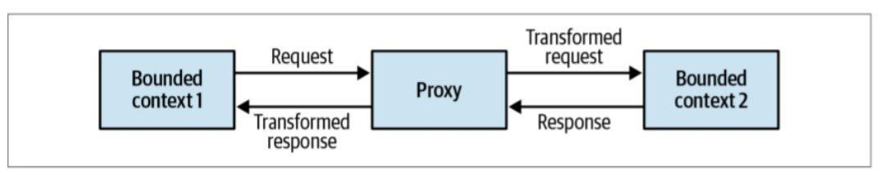
 در یک سرویس میزبان باز، ترجمه به زبان عمومی هنگام پردازش درخواست‌های دریافتی انجام می‌شود، و در یک لایه ضد فساد، هنگام فراخوانی بافت محدود بالادستی اتفاق می‌افتد. در برخی موارد، بارگذاری منطق ترجمه به یک مؤلفه خارجی مانند الگوی دروازه API می تواند مقرون به صرفه تر و راحت تر باشد. مؤلفه دروازه API می تواند یک راه حل مبتنی بر نرم افزار منبع باز باشد، یا می تواند یک سرویس مدیریت شده یک فروشنده ابری باشد. برای بافت‌های محدودی که الگوی میزبان باز OHS را پیاده‌سازی می‌کنند، دروازه API مسئول تبدیل مدل داخلی به زبان منتشر شده با بهینه‌سازی ادغام است. علاوه بر این، داشتن یک دروازه API صریح می‌تواند فرآیند مدیریت و ارائه نسخه‌های متعدد از API بافت محدود را کاهش دهد 
 
 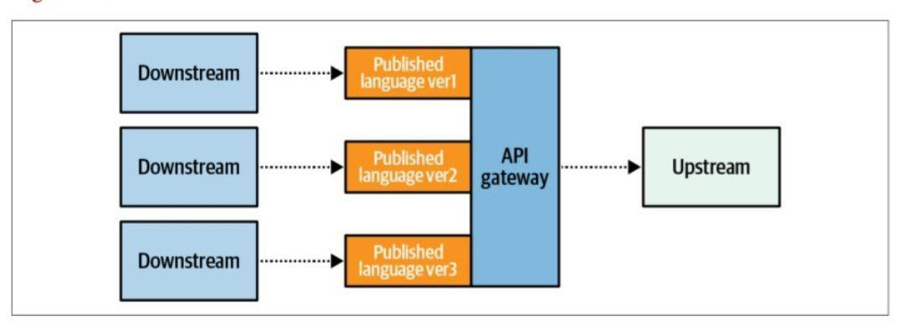
### لایه‌های ضد فساد پیاده‌سازی شده با استفاده از یک دروازه API می‌توانند توسط چندین بافت محدود پایین دست مصرف شوند. 

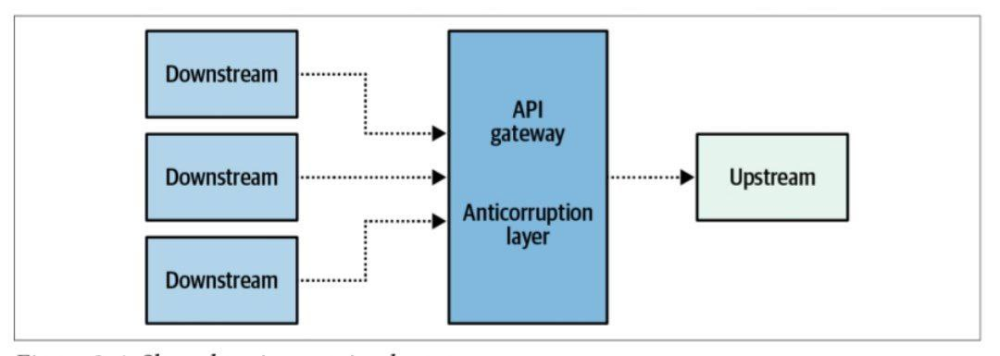
 در چنین مواردی،  لایه ضد فساد به عنوان یک بافت محدود خاص یکپارچه سازی عمل می کند. لایه مشترک ضد فساد چنین بافت‌های محدود، که عمدتاً مسئول تغییر مدل‌ها برای مصرف راحت‌تر توسط سایر مؤلفه‌ها هستند، اغلب به عنوان بافت‌های تبادلی نامیده می‌شوند.

# ناهمزمان:
برای ترجمه مدل‌های مورد استفاده در ارتباطات ناهمزمان، می‌توانید یک پروکسی پیام را پیاده‌سازی کنید: یک جزء واسطه که مشترک پیام‌هایی است که از بافت محدود منبع می‌آیند. پروکسی تبدیل‌های مدل مورد نیاز را اعمال می کند و پیام های حاصل را به مشترک هدف ارسال می‌کند  

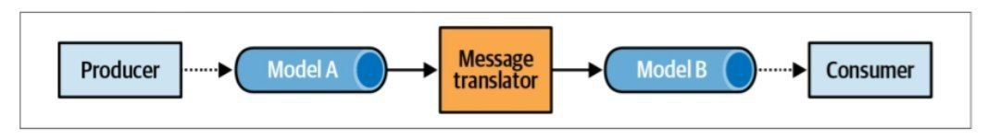
 علاوه بر ترجمه مدل پیام‌ها، مؤلفه رهگیری همچنین می‌تواند با فیلتر کردن پیام‌های نامربوط، نویز را در بافت محدود هدف کاهش دهد. ترجمه مدل ناهمزمان هنگام اجرای یک سرویس میزبان باز ضروری است. این یک اشتباه رایج است که یک زبان منتشر شده را برای اشیاء مدل طراحی و در معرض دید قرار دهیم و اجازه دهیم رویدادهای دامنه همانطور که هستند منتشر شوند، در نتیجه مدل پیاده‌سازی بافت محدود را نشان می‌دهد.  ترجمه ناهمزمان را می توان برای رهگیری رویدادهای دامنه و تبدیل آنها به یک زبان منتشر شده مورد استفاده قرار داد، بنابراین کپسوله سازی بهتری از جزئیات پیاده سازی بافت محدود را فراهم می کند، 

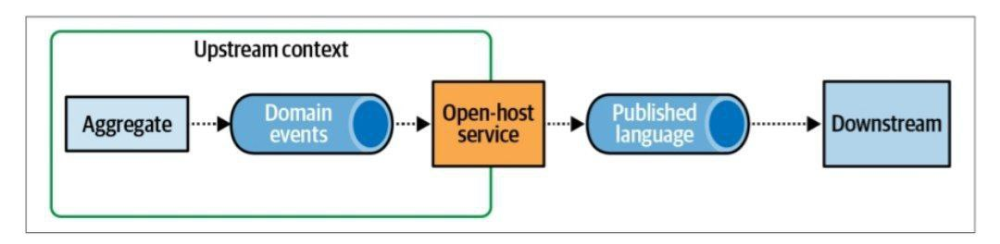
  علاوه بر این، ترجمه پیام ها به زبان منتشر شده، تمایز بین رویدادهای خصوصی را که برای نیازهای داخلی بافت محدود در نظر گرفته شده اند و رویدادهای عمومی که برای ادغام با سایر بافت‌های محدود طراحی شده اند، امکان پذیر می کند

# ترجمه مدل Stateful:
برای تبدیل مدل های مهم تر برای مثال: زمانی که مکانیسم ترجمه باید داده های منبع را جمع کند یا داده ها را از چندین منبع در یک مدل واحد متحد کند، ممکن است به یک ترجمه حالتی نیاز باشد. اجازه دهید در مورد هر یک از این موارد استفاده صحبت کنیم

# جمع‌آوری داده‌های ورودی:
فرض کنید یک بافت محدود علاقمند به جمع‌آوری درخواست‌های ورودی و پردازش آنها به صورت دسته‌ای برای بهینه‌سازی عملکرد است.  در این مورد، ممکن است برای درخواست‌های همزمان و ناهمزمان به تجمیع نیاز باشد 

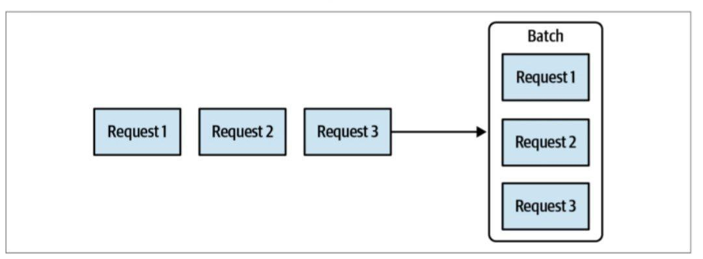
 درخواست‌های دسته‌بندی یکی دیگر از موارد استفاده رایج برای تجمیع داده‌های منبع، ترکیب چندین پیام ریزدانه در یک پیام واحد حاوی داده‌های یکپارچه است، همانطور که در تصویر زیر نشان داده شده است
 
 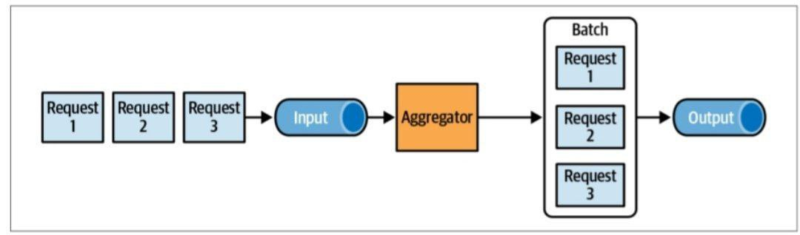

تبدیل مدلی که داده های ورودی را جمع می کند، نمی تواند با استفاده از یک دروازه API پیاده سازی شود، و بنابراین نیاز به پردازش دقیق تر و حالت دار دارد.  منطق ترجمه برای ردیابی داده های دریافتی و پردازش آنها بر اساس آن، به ذخیره سازی دائمی خود نیاز دارد 

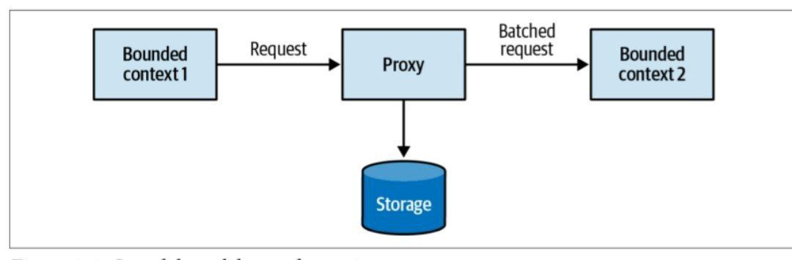

# یکپارچه سازی چندین منبع:
یک بافت محدود ممکن است نیاز به پردازش انبوه داده ها از چندین منبع، از جمله سایر بافت‌های محدود داشته باشد.یک مثال معمولی برای این الگوی backend-for-frontend است، که در آن رابط کاربر باید داده های منشأ گرفته از چندین سرویس را ترکیب کند. مثال دیگر یک بافت محدود است که باید داده ها را از چندین بافت دیگر پردازش کند و منطق تجاری پیچیده را برای پردازش همه داده ها پیاده سازی کند. در این مورد، جدا کردن پیچیدگی‌های یکپارچه‌سازی و منطق کسب‌وکار با قرار دادن بافت محدود با یک لایه ضد فساد که داده‌ها را از همه بافت‌های محدود دیگر جمع‌آوری می‌کند، می‌تواند سودمند باشد. 

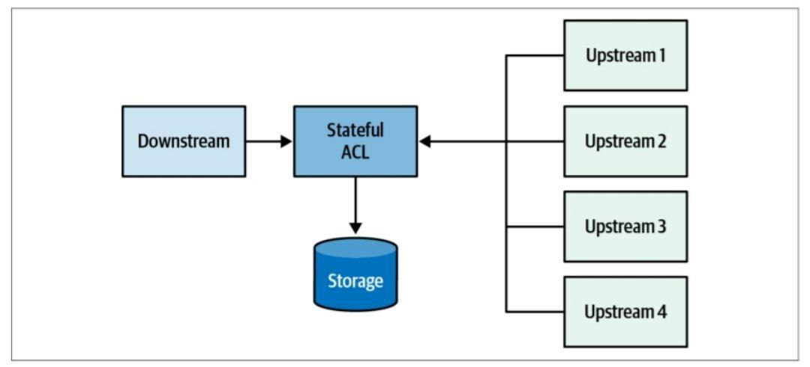

# صندوق خروجی:
الگوی صندوق خروجی تصویر پنجم در کامنت انتشار قابل اعتماد رویدادهای دامنه را با استفاده از الگوریتم زیر تضمین می کند:
  • هم وضعیت کل به روز شده و هم رویدادهای دامنه جدید در یک تراکنش اتمی انجام می شوند.
  • یک رله پیام واکشی رویدادهای دامنه جدید از پایگاه داده.
  • رله رویدادهای دامنه را در گذرگاه پیام منتشر می کند.
  • پس از انتشار موفقیت آمیز، رله یا رویدادها را به عنوان منتشر شده در پایگاه داده علامت گذاری می کند یا آنها را به طور کامل حذف می کند.

# حماسه(saga):
یکی از اصول اصلی طراحی تجمیع این است که هر تراکنش را به یک نمونه از یک تجمیع محدود کنیم. این تضمین می کند که مرزهای یک تجمیع به دقت در نظر گرفته شده و مجموعه منسجمی از عملکردهای تجاری را در بر می‌گیرد. اما مواردی وجود دارد که شما باید یک فرآیند تجاری را پیاده سازی کنید که چندین تجمیع را در بر می گیرد.
 برای مثال: یک‌ کمپین تبلیغاتی را در نظر بگیرید که شامل درخواست، دریافت، رد، تایید و انتشار تبلیغ می‌باشد
 این جریان شامل دو نهاد تجاری است: کمپین تبلیغاتی و ناشر. قرار دادن واحدهای تجاری در یک مرز تجمیع یکسان قطعاً بیش از حد خواهد بود، زیرا اینها به وضوح نهادهای تجاری متفاوتی هستند که مسئولیت‌های متفاوتی دارند و ممکن است به زمینه‌های محدود متفاوتی تعلق داشته باشند.  در عوض، این جریان می تواند به عنوان یک حماسه اجرا شود.

یک فرآیند تجاری طولانی مدت است. این امر نه لزوماً از نظر زمانی، زیرا حماسه‌ها می‌توانند از چند ثانیه تا چند سال اجرا شوند، بلکه از نظر تراکنش‌ها: یک فرآیند تجاری که چندین تراکنش را در بر می‌گیرد. تراکنش‌ها نه تنها توسط تجمیع‌ها، بلکه توسط هر مؤلفه‌ای که رویدادهای دامنه را منتشر می‌کند و به دستورات پاسخ می‌دهد قابل رسیدگی است.  حماسه به وقایع منتشر شده توسط اجزای مربوطه گوش می دهد و دستورات بعدی را برای سایر اجزا صادر می کند. اگر یکی از مراحل اجرا ناموفق باشد، حماسه مسئول صدور اقدامات جبرانی مربوطه برای اطمینان از ثابت ماندن وضعیت سیستم است 

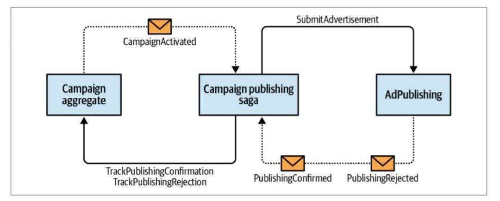

# سازگاری:
اگرچه الگوی حماسه یک تراکنش چند جزئی را تنظیم می کند، حالات اجزای درگیر در نهایت سازگار است. و اگرچه حماسه در نهایت دستورات مربوطه را اجرا می کند، هیچ دو تراکنشی را نمی توان اتمی در نظر گرفت.
این با یکی دیگر از اصول طراحی کل مرتبط است:
فقط داده‌های درون مرزهای یک تجمیع را می‌توان به شدت سازگار در نظر گرفت.
همه چیز بیرون در نهایت سازگار است.
از این به عنوان یک اصل راهنما استفاده کنید تا مطمئن شوید که از حماسه ها برای جبران مرزهای نادرست کل سوء استفاده نمی کنید.  عملیات تجاری که باید به یک تجمیع تعلق داشته باشند به داده های کاملاً سازگار نیاز دارند.
الگوی حماسه اغلب با الگوی دیگری اشتباه گرفته می شود: مدیر فرآیند.  اگرچه پیاده سازی مشابه است، اما این الگوهای متفاوتی هستند.

# مدیر فرآیند:
الگوی حماسه جریان ساده و خطی را مدیریت می کند. به بیان دقیق، یک حماسه رویدادها را با دستورات مربوطه مطابقت می دهد. در مثال‌هایی که برای نشان دادن پیاده‌سازی حماسه استفاده کردیم، در واقع تطبیق ساده رویدادها با دستورات را پیاده‌سازی کردیم:
الگوی مدیر فرآیند، در تصویر زیر نشان داده شده است،

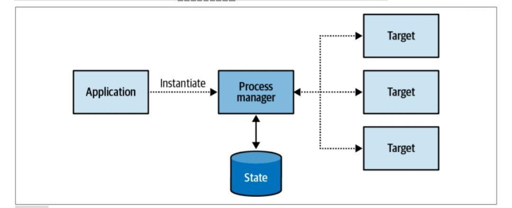
 برای اجرای یک فرآیند مبتنی بر منطق تجاری در نظر گرفته شده است.  این به عنوان یک واحد پردازش مرکزی تعریف می شود که وضعیت توالی را حفظ می کند و مراحل پردازش بعدی را تعیین می کند.

به عنوان یک قانون ساده، اگر یک حماسه حاوی عبارات if-else برای انتخاب مسیر صحیح عمل باشد، احتمالاً یک مدیر فرآیند است. تفاوت دیگر بین یک مدیر فرآیند و یک حماسه این است که یک حماسه به طور ضمنی با مشاهده یک رویداد خاص، نمونه‌سازی می‌شود.  از طرف دیگر، یک مدیر فرآیند نمی تواند به یک رویداد منبع واحد محدود شود. در عوض، این یک فرآیند تجاری منسجم است که از چند مرحله تشکیل شده است. از این رو، یک مدیر فرآیند باید به صراحت معرفی شود.  به مثال زیر توجه کنید:
 رزرو یک سفر کاری با الگوریتم مسیریابی شروع می شود که مقرون به صرفه ترین مسیر پرواز را انتخاب می کند و از کارمند می خواهد که آن را تأیید کند. در صورتی که کارمند مسیر دیگری را ترجیح دهد، مدیر مستقیم آنها باید آن را تأیید کند. پس از رزرو پرواز، یکی از هتل های از پیش تایید شده باید برای تاریخ های مناسب رزرو شود.  اگر هتلی در دسترس نباشد، بلیط هواپیما باید کنسل شود. در این مثال، هیچ نهاد مرکزی برای شروع فرآیند رزرو سفر وجود ندارد.  رزرو سفر فرآیندی است و باید به عنوان مدیر فرآیند اجرا شود 
 
 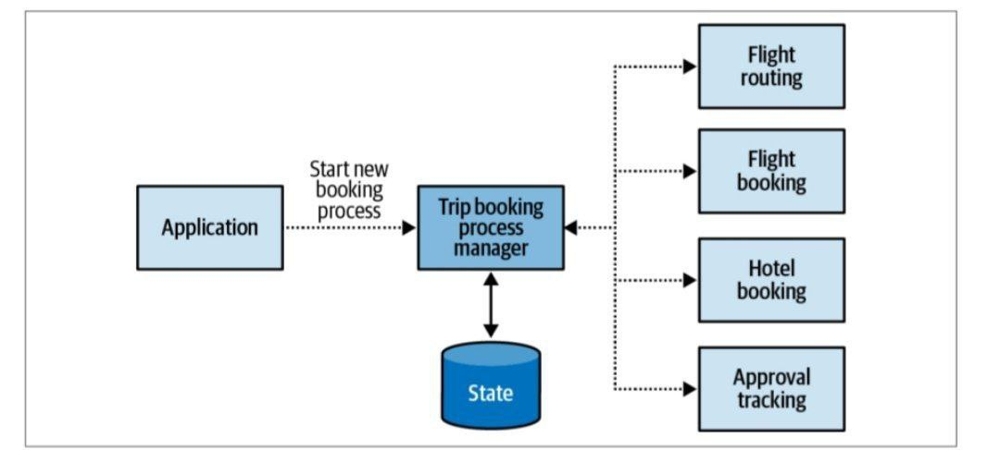

[نویسنده: بهزاد آزادی](https://github.com/behzad-azadi2693)

[وب سایت](https://codecrafters.ir)

[کانال تلگرامی](https://t.me/Code_Crafters)

