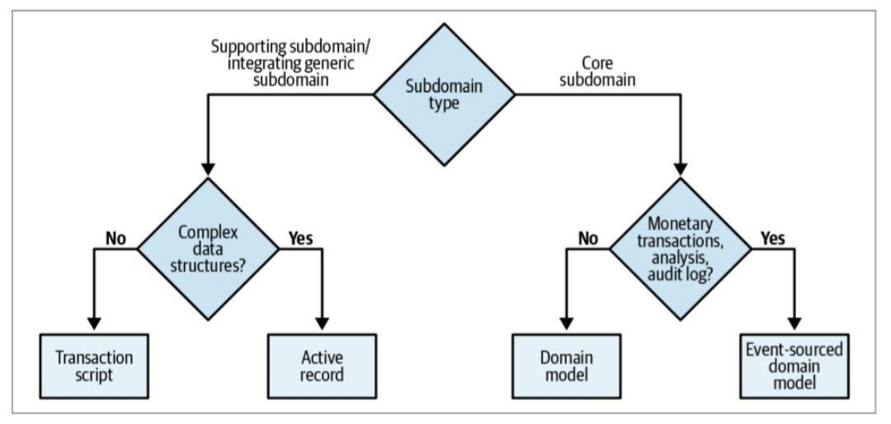
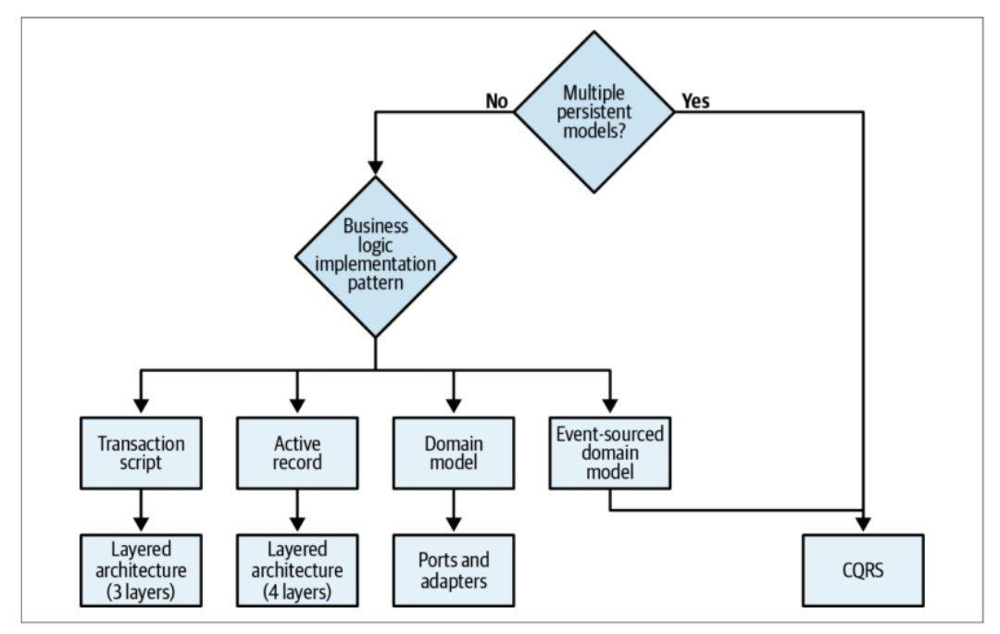
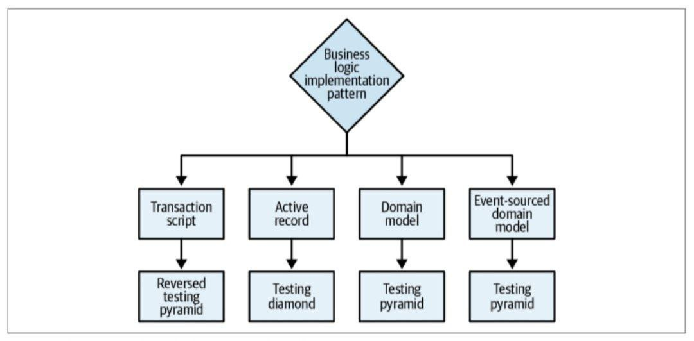
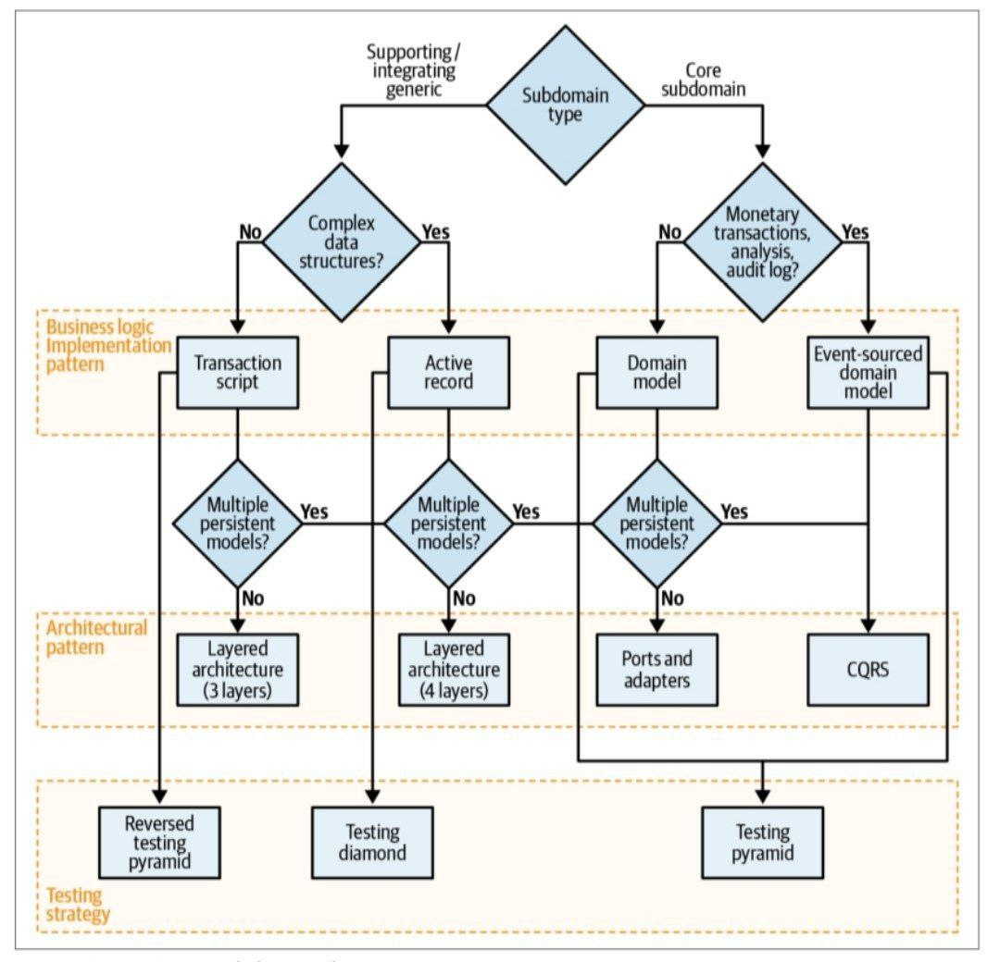

### طراحی اکتشافی (heuristic) 

در بخش‌های ابتدایی راجب ابزارهای طراحی دامنه محور برای تجزیه و تحلیل حوزه‌های تجاری و تصمیم گیری در مورد طراحی استراتژیک صحبت کردیم. در بخش دیگر درباره الگوی طراحی تاکتیکی، راه‌های مختلف برای پیاده سازی منطق تجاری، سازماندهی معماری سیستم و برقراری ارتباط بین اجزای سیستم حرف زدیم

در ادامه راجب ایجاد پل بین دو بخش طراحی استراتژیک و طراحی تاکتیکی صحبت میکنیم

# اکتشافی:
یک قانون سخت و قطعی نیست. در عوض، این یک قانون سرانگشتی است: تضمینی برای کامل بودن نیست، اما برای اهداف فوری کافی است. به عبارت دیگر، استفاده از اکتشافی یک رویکرد حل مسئله موثر است که نویز ذاتی بسیاری از نشانه‌ها را نادیده می‌گیرد و در عوض بر «نیروهای باتلاقی» که در مهم‌ترین نشانه‌ها منعکس شده‌اند تمرکز می‌کند. حوزه‌های مختلف کسب‌وکار و در اصل مشکلاتی که تصمیم‌های طراحی مختلف به آن‌ها پرداخته‌اند.

# بافت‌های محدود:
هم مرزهای گسترده و هم باریک می‌توانند با تعریف یک بافت محدود معتبر که یک زبان فراگیر ثابت را در بر می‌گیرد، مناسب باشند. اما با این حال، اندازه بهینه یک بافت محدود چقدر است؟ این سوال به ویژه با توجه به معادله مکرر بافت‌های محدود با میکروسرویس‌ها اهمیت دارد. آیا باید همیشه برای کوچک‌ترین بافت‌های محدود ممکن تلاش کنیم؟
### اکتشافی مفید و آشکار بسیاری برای تعیین مرزهای یک سرویس وجود دارد
 اندازه سرویس یکی از کم کاربردترین هاست
 به جای اینکه مدل را تابعی از اندازه دلخواه قرار دهیم که برای بافت‌های محدود کوچک بهینه سازی می‌شود. انجام برعکس آن بسیار موثرتر است: اندازه بافت محدود را به عنوان تابعی از مدلی که در بر می‌گیرد در نظر بگیرید. تغییرات نرم‌افزاری که بر بافت‌های محدود متعدد تأثیر می‌گذارند، گران هستند و به هماهنگی زیادی نیاز دارند، به‌ویژه اگر بافت‌های محدود تحت تأثیر توسط تیم‌های مختلف پیاده‌سازی شوند. چنین تغییراتی که در یک بافت محدود محصور نشده‌اند، نشانه طراحی بی اثر مرزهای بافت‌ها هستند. متأسفانه، بازسازی مرزهای بافت محدود کاری گران است، و در بسیاری از موارد، مرزهای ناکارآمد بدون مراقبت باقی می مانند و در نهایت بدهی فنی انباشته می شوند

تغییراتی که مرزهای بافت‌های محدود را باطل می کند، معمولاً زمانی رخ می دهد که دامنه کسب و کار به خوبی شناخته نشده باشد یا الزامات کسب و کار به طور مکرر تغییر کند. هم نوسانات و هم عدم قطعیت از ویژگی های هسته هستند. ما می توانیم آن را به عنوان یک هوریستیک برای طراحی مرزهای بافت محدود استفاده کنیم. مرزهای بافت محدود گسترده، یا آنهایی که چندین زیر دامنه را در بر می گیرند، اشتباه کردن در مورد مرزها یا مدل های زیرخ دامنه های گنجانده شده را ایمن تر می کنند. بازسازي مرزهاي منطقي به طور قابل توجهي كمتر از بازسازي مرزهاي فيزيكي است. از این رو، هنگام طراحی زمینه های محدود، با مرزهای گسترده تر شروع کنید. در صورت نیاز، با کسب دانش دامنه، مرزهای گسترده را به مرزهای کوچکتر تجزیه کنید. این اکتشافی عمدتاً برای بافت‌های محدود که زیر دامنه‌های اصلی را در بر می‌گیرد، اعمال می‌شود، زیرا هم زیردامنه‌های عمومی و هم زیردامنه‌های پشتیبان فرمول‌بندی‌شده‌تر و بسیار کمتر فرار هستند. هنگام ایجاد یک بافت محدود که حاوی یک زیر دامنه اصلی است، می‌توانید از خود در برابر تغییرات پیش‌بینی نشده با اضافه کردن سایر زیر دامنه‌هایی که زیر دامنه اصلی اغلب با آنها تعامل دارد، محافظت کنید.

# الگوهای پیاده‌سازی منطق تجاری
چهار روش مختلف برای مدل‌سازی منطق تجاری را آموختید: اسکریپت تراکنش، رکورد فعال، مدل دامنه، و الگوهای مدل دامنه منبع رویداد. هر دو اسکریپت تراکنش و الگوهای رکورد فعال برای زیر دامنه‌هایی با منطق تجاری ساده مناسب‌تر هستند: برای مثال، پشتیبانی از زیر دامنه‌ها یا ادغام یک راه‌حل شخص ثالث برای یک زیر دامنه عمومی. تفاوت بین این دو الگو در پیچیدگی ساختارهای داده است. الگوی اسکریپت تراکنش می تواند الگوهای پیاده سازی منطق تجاری برای ساختارهای داده ساده استفاده می شود، در حالی که الگوی رکورد فعال به کپسوله کردن نگاشت ساختارهای داده پیچیده به پایگاه داده زیربنایی کمک می کند. 

# مدل دامنه و نوع آن
مدل دامنه منبع رویداد، خود را به زیر دامنه‌هایی که منطق تجاری پیچیده‌ای دارند، اختصاص می‌دهند: زیر دامنه‌های اصلی.  زیر دامنه های اصلی که با تراکنش های پولی سروکار دارند، طبق قانون موظف به ارائه گزارش حسابرسی هستند یا نیاز به تجزیه و تحلیل عمیق از رفتار سیستم دارند، با مدل دامنه منبع رویداد بهتر مورد توجه قرار می گیرند.

با در نظر گرفتن همه اینها، یک اکتشافی موثر برای انتخاب الگوی پیاده سازی منطق تجاری مناسب، پرسیدن سؤالات زیر است:
  • آیا زیردامنه پول یا سایر تراکنش های پولی را ردیابی می کند یا باید یک گزارش حسابرسی ثابت ارائه کند، یا تجزیه و تحلیل عمیق رفتار آن مورد نیاز کسب و کار است؟  اگر چنین است، از مدل دامنه منبع رویداد استفاده کنید.  در غیر این صورت...
  • آیا منطق تجاری ساب دامنه پیچیده است؟  اگر چنین است، یک مدل دامنه پیاده سازی کنید.
 در غیر این صورت...
  • آیا زیر دامنه شامل ساختارهای داده پیچیده است؟ اگر چنین است، از الگوی رکورد فعال استفاده کنید.  در غیر این صورت...
  • یک اسکریپت تراکنش را پیاده سازی کنید.

از آنجایی که یک رابطه قوی بین پیچیدگی یک زیر دامنه و نوع آن وجود دارد، می‌توانیم اکتشافات را با استفاده از درخت تصمیم مبتنی بر دامنه تجسم کنیم 

ما می توانیم از یک اکتشافی دیگر برای تعریف تفاوت بین منطق تجاری پیچیده و ساده استفاده کنیم. مرز بین این دو نوع منطق تجاری خیلی واضح نیست، اما مفید است. به طور کلی، منطق پیچیده کسب و کار شامل قوانین پیچیده تجاری، یک رویکرد ساده عمدتاً حول اعتبارسنجی ورودی‌ها می‌چرخد. اکتشافی دیگر برای ارزیابی پیچیدگی مربوط به پیچیدگی خود زبان فراگیر است. آیا عمدتاً عملیات CRUD را توصیف می کند یا فرآیندها و قوانین تجاری پیچیده تری را توصیف می کند؟ تصمیم گیری در مورد الگوی پیاده سازی منطق کسب و کار با توجه به پیچیدگی منطق کسب و کار و ساختارهای داده آن راهی برای تایید مفروضات شما در مورد نوع زیر دامنه است. فرض کنید آن را یک زیردامنه اصلی در نظر می گیرید، اما بهترین الگو، اسکریپت رکورد یا تراکنش فعال است. یا فرض کنید آنچه شما فکر می کنید یک زیردامنه پشتیبان است به یک مدل دامنه یا یک مدل دامنه منبع رویداد نیاز دارد. در این مورد، فرصتی عالی برای بازبینی مفروضات خود در مورد حوزه فرعی و به طور کلی دامنه تجاری است. به یاد داشته باشید، مزیت رقابتی یک زیردامنه اصلی لزوماً فنی نیست.

# الگوهای معماری:
با سه الگوی معماری آشنا شدید: معماری لایه ای، پورت ها و آداپتورها و CQRS
دانستن الگوی پیاده سازی منطق تجاری مورد نظر، انتخاب یک الگوی معماری را آسان می کند:
  • مدل دامنه منبع رویداد به CQRS نیاز دارد.  در غیر این صورت، سیستم در گزینه‌های جستجوی داده‌های خود بسیار محدود خواهد بود و تنها با شناسه خود یک نمونه را واکشی می‌کند
  • مدل دامنه به معماری پورت ها و آداپتورها نیاز دارد. در غیر این صورت، معماری لایه‌ای باعث می‌شود که تجمیع‌ها و ارزش‌گذاری اشیاء از ماندگاری نادیده گرفته شوند
  • الگوی رکورد فعال به بهترین وجه با یک معماری لایه ای همراه با لایه کاربردی (سرویس) اضافی همراه است. این برای منطق کنترل رکوردهای فعال است
  • الگوی اسکریپت تراکنش را می توان با معماری لایه ای حداقلی که تنها از سه لایه تشکیل شده است، پیاده سازی کرد.

 تنها استثناء اکتشافی قبلی، الگوی CQRS است.  CQRS می تواند نه تنها برای مدل دامنه منبع رویداد، بلکه برای هر الگوی دیگری مفید باشد، اگر زیر دامنه نیاز به نمایش داده های خود در چندین مدل پایدار داشته باشد. 
 
 
  یک درخت تصمیم برای انتخاب یک الگوی معماری بر اساس این اکتشافات را نشان می دهد.

# استراتژی تست:
دانش الگوی پیاده سازی منطق تجاری و الگوی معماری را می توان به عنوان یک روش اکتشافی برای انتخاب یک استراتژی تست برای پایه کد مورد استفاده قرار داد.  به سه استراتژی تست نشان داده شده در تصویر نگاهی بیندازید

تفاوت بین استراتژی‌های تست تاکید آنها بر انواع مختلف آزمون‌ها است: واحد، ادغام و پایان رو به انتها.
بیایید هر استراتژی و زمینه ای که هر الگو باید در آن استفاده شود را تحلیل کنیم.

# هرم تست:
هرم تست کلاسیک بر تست های واحد، تست های ادغام کمتر و حتی تست های سرتاسر کمتر تاکید دارد. هر دو نوع الگوهای مدل دامنه به بهترین وجه با هرم آزمایشی مورد بررسی قرار می گیرند. انباشته ها و اشیاء ارزش واحدهای عالی برای آزمایش موثر منطق تجاری هستند.

# تست الماس:
الماس آزمایشی بیشترین تمرکز را بر روی تست های یکپارچه سازی دارد. هنگامی که الگوی رکورد فعال استفاده می شود، منطق تجاری سیستم، طبق تعریف، در هر دو لایه منطق تجاری و خدماتی پخش می شود. بنابراین، برای تمرکز بر ادغام دو لایه، هرم آزمایشی انتخاب موثرتری است.

# هرم تست معکوس:
هرم تست معکوس بیشترین توجه را به تست های انتها به انتها می دهد: بررسی گردش کار برنامه از ابتدا تا انتها. چنین رویکردی به بهترین وجه با پایگاه‌های کدی که الگوی اسکریپت تراکنش را پیاده‌سازی می‌کنند مناسب است: منطق تجاری ساده است و تعداد لایه‌ها حداقل است، که تأیید جریان سرتاسر سیستم را مؤثرتر می‌کند. 

 درخت تصمیم گیری استراتژی تست را نشان می دهد.

درخت تصمیم طراحی تاکتیکی الگوهای منطق کسب و کار، الگوهای معماری، و اکتشافات استراتژی تست را می توان با یک درخت تصمیم طراحی تاکتیکی، همانطور که در 
 تصویر زیر نشان داده شده است، متحد و خلاصه کرد. درخت تصمیم طراحی تاکتیکی همانطور که می بینید، شناسایی انواع زیر دامنه ها و پیروی از درخت تصمیم، نقطه شروع محکمی برای تصمیم گیری های طراحی ضروری به شما می دهد. با این حال، تکرار این نکته مهم است که اینها اکتشافی هستند، نه قوانین سخت. برای هر قاعده استثنایی وجود دارد، چه رسد به اکتشافی، که بنا به تعریف در صد درصد موارد صحیح نیست.

[نویسنده: بهزاد آزادی](https://github.com/behzad-azadi2693)

[وب سایت](https://codecrafters.ir)

[کانال تلگرامی](https://t.me/Code_Crafters)