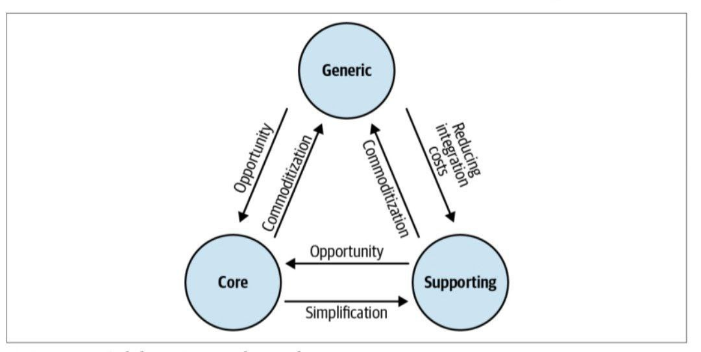

# تصمیمات طراحی در حال تحول
سیستم‌ها در حال تکامل هستند و حتی خود را در طول زمان دوباره اختراع کنند. ما نمی‌توانیم این واقعیت را هنگام طراحی سیستم‌ها نادیده بگیریم، به خصوص اگر قصد طراحی نرم‌افزاری را داشته باشیم که به خوبی با الزامات حوزه تجاری آن سازگار باشد هنگامی که تغییرات به درستی مدیریت نمی شوند، حتی پیچیده ترین و متفکرترین طراحی نیز در نهایت تبدیل به یک کابوس برای حفظ و تکامل خواهد شد. ما به این موضوع می پردازد که چگونه تغییرات در محیط یک پروژه نرم افزاری می تواند بر تصمیمات طراحی تأثیر بگذارد و چگونه طراحی را بر این اساس تکامل بخشد. چهار عامل متداول تغییر را بررسی میکنیم: حوزه کسب و کار، ساختار سازمانی، دانش حوزه و رشد

در بخش‌های قبلی سه نوع زیردامنه تجاری را آموختیم و تفاوت هرکدام را یادگرفتیم: اصلی، عمومی، پشتیبانی

نوع زیردامنه در حال بازی، بر تصمیمات طراحی استراتژیک و تاکتیکی تأثیر می گذارد:
  • نحوه طراحی مرزهای زمینه های محدود
  • نحوه هماهنگ سازی یکپارچگی بین زمینه ها
  • از کدام الگوهای طراحی برای تطبیق با پیچیدگی منطق تجاری استفاده شود

جهت طراحی نرم افزاری که بر اساس نیازهای حوزه کسب و کار هدایت می شود، شناسایی زیر دامنه های تجاری و انواع آنها بسیار مهم است و به همان اندازه مهم است که نسبت به تکامل زیر دامنه ها هوشیار باشید

# دامنه اصلی به عمومی
تصور کنید یک‌ شرکت خرده فروشی A یک راهکار خاص خود برای تحویل دارد که بسیار بهینه است و مزیت رقابتی ایجاد می‌کند، شرکت B به راهکار بهتری دست می‌یابد و آنرا ارائه میدهد که از شرکت A بهتر است و صرف هزینه کمتری برای مشتریان دارد، راهکار شرکت A دیگر مزیت رقابتی ندارد و از دامنه اصلی به دامنه عمومی تبدیل می‌شود

# دامنه عمومی به اصلی
شرکت A در بخش فروش خود دچار مشکلاتی شده که هزینه‌هایی براش بوجود آورده، در طی یکسری بررسی‌ها و تحقیقات به نتایجی دست پیدا کرده که با تغییر در ساختار دامنه خود مشکلات رو حل کرده و توانسته مزیت رقابتی ایجاد کند که در دست رقیبانش هم نیست و با اعمال اینکار و تغییرات دامنه عمومی خود را به اصلی تغییر می‌دهد نمونه آن در دنیای واقعی آمازون وب سرویس است

# دامنه پشتیبانی به عمومی
شرکت A برای پشتیبانی از بخش بازاریابی خود متکی به قراردادهایی است که دارد هیچ چیز خاصی وجود ندارد یکسری عملیات‌های CRUD است با OCR در طی گذشت زمان با روی کار آمدن جستجوهای متن کامل و ارائه راهکارهای جدید شرکت تصمیم میگیرد از قراردادهای خود بنفع یک برنامه باز open source کنار بگیرد و آنرا بالا اوردن و جایگزین رویکرد خود کند

# دامنه پشتیبانی به اصلی
یک زیر دامنه پشتیبانی می تواند به یک زیر دامنه اصلی نیز تبدیل شود برای مثال: اگر یک شرکت راهی برای بهینه سازی منطق پشتیبانی به گونه ای پیدا کند که یا هزینه ها را کاهش دهد یا سود اضافی ایجاد کند. علامت معمول چنین تحولی، پیچیدگی فزاینده منطق تجاری زیردامنه پشتیبانی کننده است. طبق تعریف، زیر دامنه‌های پشتیبانی ساده هستند و عمدتاً شبیه رابط‌های CRUD یا فرآیندهای ETL هستند. با این حال، اگر منطق تجاری در طول زمان پیچیده تر شود، باید دلیلی برای پیچیدگی اضافی وجود داشته باشد. اگر بر سود شرکت تأثیر نمی گذارد، چرا پیچیده تر می شود؟ این پیچیدگی تصادفی کسب و کار است. از سوی دیگر، اگر سودآوری شرکت را افزایش دهد، نشانه ای از تبدیل شدن یک ساب دامنه پشتیبانی به یک زیر دامنه اصلی است

# دامنه پشتیبانی به اصلی
یک زیر دامنه اصلی می تواند به مرور زمان به یک زیر دامنه پشتیبانی تبدیل شود. این می تواند زمانی اتفاق بیفتد که پیچیدگی زیر دامنه توجیه نشده باشد. به عبارت دیگر، سودآور نیست. در چنین مواردی، سازمان ممکن است تصمیم بگیرد که پیچیدگی های اضافی را کاهش دهد و حداقل منطق مورد نیاز برای پشتیبانی از اجرای سایر زیر دامنه ها را باقی بگذارد

# دامنه عمومی به پشتیبانی
به همان دلایل برای زیر دامنه اصلی، یک زیر دامنه عمومی می تواند به یک زیردامنه پشتیبانی تبدیل شود. شرکت A تصمیم گرفته است که پیچیدگی یکپارچه سازی راه حل منبع باز، مزایا را توجیه نمی کند و به سیستم داخلی متوسل شده است. در نتیجه، زیر دامنه عمومی به یک زیر دامنه پشتیبانی تبدیل شده است

# نگرانی های طراحی استراتژیک
تغییر در نوع یک زیر دامنه مستقیماً بر بافت محدود آن و تصمیمات مربوط به طراحی استراتژیک تأثیر می گذارد. الگوهای مختلف یکپارچه سازی بافت محدود، انواع مختلف زیر دامنه را در خود جای می دهند. زیردامنه های اصلی باید با استفاده از لایه های ضدفساد از مدل های خود محافظت کنند و باید با استفاده از زبان های منتشر شده OHS از مصرف کنندگان در برابر تغییرات مکرر در مدل های پیاده سازی محافظت کنند

الگوی ادغام دیگری که تحت تأثیر چنین تغییراتی قرار می گیرد، الگوی راه های جداگانه است. تیم ها می توانند از این الگو برای پشتیبانی و زیردامنه های عمومی استفاده کنند. اگر زیر دامنه به یک زیر دامنه اصلی تبدیل شود، کپی کردن عملکرد آن توسط چندین تیم دیگر قابل قبول نیست. از این رو، تیم ها چاره ای جز ادغام پیاده سازی های خود ندارند. رابطه مشتری و تامین کننده در این مورد منطقی تر خواهد بود، زیرا زیردامنه اصلی تنها توسط یک تیم پیاده سازی می شود.از نقطه نظر استراتژی پیاده سازی، زیر دامنه های اصلی و پشتیبانی کننده در نحوه پیاده سازی متفاوت هستند. زیردامنه های پشتیبانی می توانند برون سپاری شوند یا به عنوان "چرخ های آموزشی" برای استخدام های جدید استفاده شوند. زیردامنه های اصلی باید در داخل پیاده سازی شوند و تا حد امکان نزدیک به منابع دانش دامنه باشند. بنابراین، هنگامی که یک زیر دامنه پشتیبانی کننده به یک زیر دامنه اصلی تبدیل می شود، پیاده سازی آن باید به داخل منتقل شود. همین منطق برعکس عمل می کند. اگر یک زیر دامنه اصلی به یک زیر دامنه پشتیبان تبدیل شود، می توان پیاده سازی را برون سپاری کرد تا به تیم های تحقیق و توسعه داخلی اجازه داد روی زیر دامنه های اصلی تمرکز کنند.

# نگرانی های طراحی تاکتیکی
شاخص اصلی تغییر در نوع یک زیر دامنه، ناتوانی طراحی فنی موجود برای پشتیبانی از نیازهای فعلی کسب و کار است. به مثالی برگردیم که یک زیر دامنه پشتیبان تبدیل به یک زیر دامنه اصلی می شود. زیردامنه‌های پشتیبانی با الگوهای طراحی نسبتاً ساده برای مدل‌سازی منطق تجاری پیاده‌سازی می‌شوند: یعنی اسکریپت تراکنش یا الگوی رکورد فعال. این الگوها برای منطق تجاری که شامل قوانین پیچیده و متغیرهای متغیر است مناسب نیستند. اگر قوانین پیچیده و متغیرهای ثابت در طول زمان به منطق کسب و کار اضافه شوند، پایگاه کد نیز به طور فزاینده ای پیچیده می شود. اضافه کردن عملکرد جدید دردناک خواهد بود، زیرا طراحی از سطح جدیدی از پیچیدگی پشتیبانی نمی کند. این "درد" یک سیگنال مهم است. از آن به عنوان فراخوانی برای ارزیابی مجدد دامنه کسب و کار و انتخاب های طراحی استفاده کنید. نیاز به تغییر در استراتژی پیاده سازی جای ترس ندارد این طبیعی است. ما نمی‌توانیم پیش‌بینی کنیم که یک کسب‌وکار چگونه در این مسیر تکامل می‌یابد. ما همچنین نمی توانیم دقیق ترین الگوهای طراحی را برای همه انواع زیر دامنه ها اعمال کنیم. که بیهوده و بی اثر خواهد بود. ما باید مناسب ترین طرح را انتخاب کنیم و در صورت نیاز آن را تکامل دهیم. اگر تصمیم در مورد نحوه مدل‌سازی منطق کسب‌وکار آگاهانه گرفته می‌شود و شما از تمام انتخاب‌های طراحی ممکن و تفاوت‌های بین آن‌ها آگاه هستید، مهاجرت از یک الگوی طراحی به الگوی دیگر آنقدرها دردسرساز نیست. بخش‌های فرعی زیر چند نمونه را برجسته می‌کنند.

# اسکریپت تراکنش به رکورد فعال
هر دو اسکریپت تراکنش و الگوهای رکورد فعال بر اساس یک اصل هستند: منطق تجاری به عنوان یک اسکریپت رویه ای اجرا می شود. تفاوت بین آنها در نحوه مدل‌سازی ساختارهای داده است: الگوی رکورد فعال ساختارهای داده را معرفی می‌کند تا پیچیدگی نگاشت آنها را به مکانیسم ذخیره‌سازی محصور کند. در نتیجه، زمانی که کار با داده ها در یک اسکریپت تراکنش چالش برانگیز می شود، آن را در الگوی رکورد فعال تغییر دهید. به دنبال ساختارهای داده پیچیده بگردید و آنها را در اشیاء رکورد فعال محصور کنید. به جای دسترسی مستقیم به پایگاه داده، از رکوردهای فعال برای انتزاع مدل و ساختار آن استفاده کنید.

# رکورد فعال به مدل دامنه
اگر منطق تجاری که رکورد فعال را دستکاری می کند پیچیده شد و موارد بیشتری از تناقضات و تکرارها را مشاهده کردید، پیاده سازی را به الگوی مدل دامنه تغییر دهید.
 با شناسایی اشیاء ارزشی شروع کنید. چه ساختارهای داده ای را می توان به عنوان اشیاء تغییرناپذیر مدل کرد؟ به دنبال منطق تجاری مرتبط باشید و آن را نیز بخشی از اشیاء ارزشی قرار دهید. سپس، ساختارهای داده را تجزیه و تحلیل کنید و به دنبال مرزهای تراکنش باشید. برای اطمینان از صریح بودن منطق اصلاح کننده حالت، همه تنظیم کننده های رکوردهای فعال را خصوصی کنید تا فقط از داخل خود رکورد فعال اصلاح شوند. بدیهی است، انتظار دارید که تالیف با شکست مواجه شود. با این حال، اشتباهات کامپایل روشن می کند که منطق تغییر حالت در کجا قرار دارد. آن را در محدوده‌های رکورد فعال تغییر دهید.

هنگامی که تمام منطق کسب و کار اصلاح کننده حالت به داخل مرزهای اشیاء مربوطه منتقل می شود، بررسی کنید که چه سلسله مراتبی لازم است تا اطمینان حاصل شود که از بررسی قوی و منسجم قوانین تجاری و متغیرهای آن اطمینان حاصل کنید. اینها نامزدهای خوبی برای کل هستند.

با در نظر گرفتن اصول طراحی به دنبال کوچکترین مرزهای تراکنش باشید، یعنی کوچکترین مقدار داده ای که نیاز دارید تا کاملاً ثابت نگه دارید. سلسله مراتب را در امتداد آن مرزها تجزیه کنید. مطمئن شوید که تجمیع‌های خارجی فقط با شناسه آنها ارجاع داده می شوند. در نهایت، برای هر مجموعه، ریشه آن یا نقطه ورود برای رابط عمومی آن را مشخص کنید. متدهای همه اشیای داخلی دیگر در مجموع را خصوصی کنید و فقط از داخل مجموعه قابل فراخوانی باشند.

# مدل دامنه به مدل دامنه با منبع رویداد
هنگامی که یک مدل دامنه با مرزهای مجموع به درستی طراحی شده دارید، می توانید آن را به مدل منبع رویداد انتقال دهید. به‌جای اصلاح مستقیم داده‌های مجموعه، رویدادهای دامنه مورد نیاز برای نمایش چرخه عمر مجموعه را مدل‌سازی کنید. چالش برانگیزترین جنبه تغییر یک مدل دامنه به یک مدل دامنه منبع رویداد، تاریخچه انبوه های موجود است: مهاجرت حالت "بی زمان" به مدل مبتنی بر رویداد. از آنجایی که داده‌های ریزدانه‌ای که همه تغییرات حالت گذشته را نشان می‌دهند وجود ندارد، باید رویدادهای گذشته را بر اساس بهترین تلاش تولید کنید یا رویدادهای مهاجرت را مدل کنید.

# ایجاد انتقال‌های گذشته
این رویکرد مستلزم ایجاد یک جریان تقریبی از رویدادها برای هر تجمیع است، به طوری که جریان رویدادها می‌تواند در حالت نمایشی مشابه در پیاده‌سازی اصلی پیش‌بینی شود. با این حال، مهم است که معایب این روش را در نظر داشته باشید. هدف از استفاده از منبع یابی رویداد، داشتن یک تاریخچه قابل اعتماد و کاملاً سازگار از رویدادهای دامنه مجموعه ها است. هنگامی که از این رویکرد استفاده می شود، بازیابی تاریخچه کامل انتقال حالت غیرممکن است

# مدل‌سازی رویدادهای مهاجرت
رویکرد جایگزین، اذعان به فقدان دانش در مورد رویدادهای گذشته و مدل‌سازی صریح آن به عنوان یک رویداد است. بجای بازیابی رویدادهایی که ممکن است به وضعیت فعلی منجر شده باشند، یک رویداد مهاجرت را تعریف کنید و از آن برای مقداردهی اولیه جریان رویداد نمونه‌های انبوه موجود استفاده کنید: مزیت این رویکرد این است که فقدان داده های گذشته را آشکار می کند. در هیچ مرحله ای کسی نمی تواند به اشتباه تصور کند که جریان رویداد همه رویدادهای دامنه را که در طول چرخه عمر نمونه کل اتفاق افتاده‌اند را ثبت می کند. نقطه ضعف این است که آثار سیستم قدیمی برای همیشه در ذخیره‌ساز رویداد باقی می ماند. برای مثال، اگر از الگوی CQRS استفاده می‌کنید (و به احتمال زیاد از الگوی نگرانی‌های طراحی تاکتیکی استفاده می‌کنید)، پیش‌بینی‌ها همیشه باید رویدادهای مهاجرت را در نظر بگیرند.

# تغییرات سازمانی
نوع دیگری از تغییر که می تواند بر طراحی سیستم تأثیر بگذارد، تغییر در خود سازمان است. می‌توان به الگوهای مختلف ادغام زمینه های محدود نگاه کرد: مشارکت، هسته مشترک، سازگاری، لایه ضد فساد، سرویس میزبان باز و راه های جداگانه

تغییرات در ساختار سازمان می‌تواند بر سطوح ارتباط و همکاری تیم‌ها و در نتیجه روش‌هایی که بافت‌های محدود باید یکپارچه شوند تأثیر بگذارد. یک مثال بی اهمیت از چنین تغییراتی، مراکز توسعه در حال رشد است. از آنجایی که یک بافت محدود می تواند تنها توسط یک تیم پیاده سازی شود، افزودن تیم های توسعه جدید می تواند باعث شود که مرزهای بافت محدود گسترده تر موجود، به مرزهای کوچکتر تقسیم شود تا هر تیم بتواند روی بافت محدود خود کار کند. علاوه بر این، مراکز توسعه سازمان اغلب در مکان های جغرافیایی مختلف قرار دارند. هنگامی که کار روی بافت‌های محدود موجود به مکان دیگری منتقل می شود، ممکن است بر همکاری تیم ها تأثیر منفی بگذارد. در نتیجه، الگوهای یکپارچه سازی بافت های محدود باید مطابق با سناریوهای زیر تکامل یابد.

# مشارکت با مشتری-تامین کننده:
این الگو فرض می کند که ارتباط و همکاری قوی بین تیم ها وجود دارد که با گذشت زمان، این ممکن است از بین برود. برای مثال: زمانی که کار بر روی یکی از بافت‌های محدود به یک مرکز توسعه دور منتقل می شود بر ارتباطات تیم‌ها تأثیر منفی می‌گذارد و ممکن است منطقی باشد که از الگوی مشارکت به سمت رابطه مشتری-تامین کننده حرکت کنیم.

# مشتری–تامین کننده به روش‌های جداگانه:
برای تیم‌ها مشکلات ارتباطی شدید غیرمعمول نیست. این مسائل ممکن است ناشی از سیاست سازمانی یا هگعوامل دیگر باشد. چنین تیم هایی ممکن است در طول زمان مشکلات ادغام بیشتری را تجربه کنند.  در برخی مواقع، ممکن است به‌جای تعقیب مداوم نقاط پایانی یکدیگر، کپی کردن عملکرد مقرون‌ به‌ صرفه‌تر شود

[نویسنده: بهزاد آزادی](https://github.com/behzad-azadi2693)

[وب سایت](https://codecrafters.ir)

[کانال تلگرامی](https://t.me/Code_Crafters)