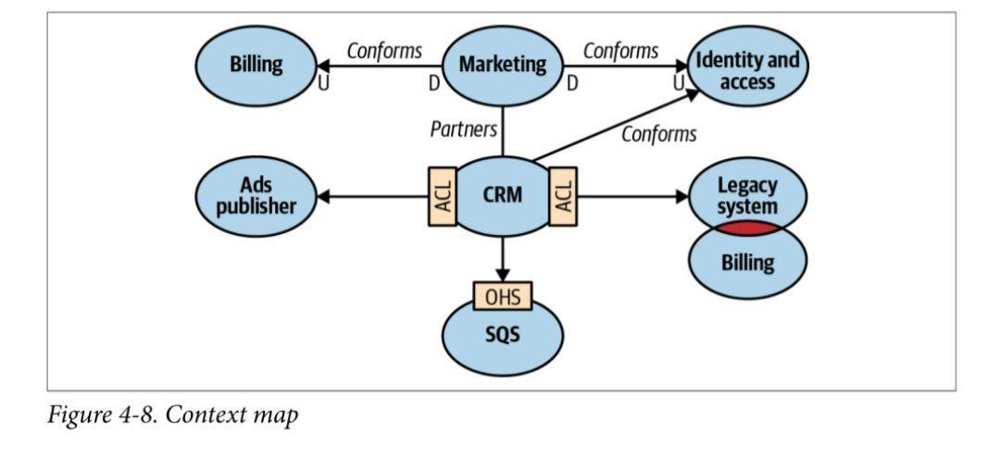

# یکپارچه سازی بافت محدود

الگوی بافت محدود علاوه بر محافظت از زبان فراگیر، مدلسازی رو هم برامون امکان پذیر میکنه، بدون مشخص شدن هدف و مرز یک مدل نمیتونید بسازیدش، مرز مسئولیت زبان‌ها رو تقسیم میکنه، یک زبان در یک بافت محدود می‌تواند دامنه کسب و کار را برای حل یک مشکل خاص مدل کند، یک بافت محدود دیگر میتواند همان واحدهای تجاری را نشان دهد اما آنها را برای حل یک مشکل متفاوت مدل کند

مدل‌ها در بافت‌های محدود متفاوت میتوانند بطور مستقل تکامل یافته و پیاده سازی شوند، (خود بافت‌های محدود مستقل نیستند) یک سیستم را نمیتوان از اجزای مستقل ساخت آنها باید با هم در تعامل باشند تا به هدف کلی سیستم دست یابند(پیاده سازی‌ها در بافت‌های محدود نیز انجام می‌شود) بافت‌ها میتوانند مستقل تکامل یابند اما باید با یکدیگر ادغام شوند. در نتیجه همیشه نقاط تماس بین بافت‌های محدود وجود خواهد داشت به این‌ -قرادادها- میگویند(لپ کلام میکروسرویس)

### نیاز به قرادادها ناشی از تفاوت در مدل‌ها و زبان‌های بافت‌های محدود است.
 هر قرارداد بیش از یک طرف را درگیر میکند لذا لازم است قراردادها تعریف و هماهنگ شوند(دو بافت محدود از زبانهای مختلف در همه حا استفاده میکنند) کدام زبان برای ادغام استفاده خواهد شد؟ این نگرانی‌های یکپارچه سازی باید توسط طراحی راه حل ارزیابی و برطرف شود

موضوعیت بحث بر سر ادغام و یکپارچه سازی بافت‌های محدود هستش، طراحی دامنه محور اینکار رو با الگوهای مدنظر خودش انجام خواهد داد، الگوها رو میتوان در سه گروه زیر دسته بندی کرد: همکاری ، مشتری-تامین کننده، راه‌های جداگانه

# همکاری:
الگوهای همکاری مربوط به بافت‌های محدودی است که توسط تیم هایی با ارتباطات تثبیت شده اجرا می شود. در ساده‌ترین حالت، اینها بافت‌های محدودی هستند که توسط یک تیم واحد پیاده‌سازی شده‌اند. این در مورد تیم هایی با اهداف وابسته نیز صدق می کند، جایی که موفقیت یک تیم به موفقیت تیم دیگر بستگی دارد و بالعکس.  باز هم، معیار اصلی در اینجا کیفیت ارتباطات و همکاری تیم ها است.
بیایید به دو الگوی DDD مناسب برای تیم های همکار نگاه کنیم: الگوهای مشارکت و هسته مشترک.

# الگوی مشارکت:
ادغام بین بافت‌های محدود به شیوه ای موقت هماهنگ می شود. یک تیم می تواند تیم دوم را در مورد تغییر در API مطلع کند، و تیم دوم همکاری خواهد کرد و تطبیق خواهد کرد، بدون درام یا درگیری، هماهنگی ادغام دو طرفه است، تیم‌ها می‌توانند تفاوت‌ها را حل کنند و مناسب ترین راه حل را انتخاب کنند، هر دو طرف در حل مسائل مربوط به ادغام که ممکن است پیش بیاید، همکاری می‌کنند، هیچ یک از تیم‌ها علاقه‌ای به مسدود کردن تیم دیگر ندارند، برای ادغام موفقیت آمیز، همکاری تثبیت شده، سطوح بالای تعهد و هماهنگی‌های مکرر بین تیم‌ها مورد نیاز است، این الگو ممکن است برای تیم‌های توزیع شده جغرافیایی مناسب نباشد به دلیل چالش‌های همگام سازی و ارتباطی

# هسته مشترک:
بافت‌های محدود مرز مدل‌ها رو مشخص میکنند، اما ممکن است مواردی رخ دهد که همان مدل زیردامنه یا بخشی ازون در کرانهای چندگانه پیاده سازی شود(مدل مشترک بر اساس نیازهای همه بافت‌های محدود طراحی شده است) مدل مشترک باید در تمام بافت‌های محدودی که از آن استفاده میکنند سازگار باشد(نمونه آن مدل authorization است)

# دامنه مشترک:
همپوشانی چرخه حیات بافت‌های محدود مشارکت‌ کننده را جفت می‌کند. تغییری که در مدل مشترک ایجاد شده است، تأثیر فوری بر تمام متون محدود دارد. از این رو، برای به حداقل رساندن اثرات آبشاری تغییرات، مدل همپوشانی باید محدود شود و تنها بخشی از مدل را که باید توسط هر دو بافت محدود اجرا شود، در معرض دید قرار دهد. در حالت ایده‌آل، هسته مشترک فقط شامل قراردادهای یکپارچه‌سازی و ساختارهای داده‌ای است که در نظر گرفته شده‌اند از مرزهای بافت‌های محدود عبور داده شوند

# پیاده‌سازی:
هسته مشترک به گونه‌ای پیاده‌سازی می‌شود که هرگونه تغییر در کد منبع آن بلافاصله در تمام بافت‌های محدودی که از آن استفاده می‌کنند منعکس شود.اگر سازمان از رویکرد تک مخزن استفاده کند، این فایل‌ها می‌توانند همان فایل‌های منبع ارجاع‌شده توسط بافت‌های محدود شده متعدد باشند. اگر استفاده از یک مخزن مشترک امکان پذیر نباشد، هسته مشترک را میتوان در یک پروژه اختصاصی استخراج کرد و در بافت‌های محدود به عنوان یک کتابخانه پیوندی ارجاع داد.هر تغییر در هسته مشترک، آزمایش‌های یکپارچه‌سازی را برای تمام بافت‌های محدود تحت تاثیر قرار میدهد. ادغام پیوسته تغییرات نیاز است زیرا هسته مشترک متعلق به چندین بافت محدود است. عدم انتشار تغییرات هسته مشترک در همه بافت‌های محدود مرتبط منجر به ناسازگاری در یک مدل می‌شود: بافت‌های محدود ممکن است(در پیاده‌سازی‌های قدیمی هسته مشترک منجر به خرابی داده‌/مشکلات اجرایی میشود)

# مشتری – تامین کننده:
دومین گروه از الگوهای همکاری که بررسی خواهیم کرد، الگوهای مشتری – تامین کننده است. یکی از بافت‌های محدود - تامین کننده - خدماتی را برای مشتریان خود ارائه می دهد.
ارائه‌دهنده خدمات «بالادست» و مشتری یا مصرف‌کننده «پایین دست» است.
بر خلاف مورد همکاری، هر دو تیم (بالا دستی و پایین دستی) می توانند به طور مستقل موفق شوند. در نتیجه، در بیشتر موارد ما یک عدم تعادل قدرت داریم: تیم بالادستی یا پایین دستی می توانند قرارداد ادغام را دیکته کنند.
 این بخش سه الگو را مورد بحث قرار می‌دهد که به چنین تفاوت‌های قدرتی می‌پردازد: الگوهای سازگاری، لایه ضدفساد و الگوهای خدمات میزبان باز.

# سازگار: 
در برخی موارد، توازن قدرت به نفع تیم بالادستی است که هیچ انگیزه واقعی برای حمایت از نیازهای مشتریان خود ندارد. در عوض، فقط قرارداد یکپارچه‌سازی را ارائه می‌کند که بر اساس مدل خودش تعریف شده است (آن را بگیرید یا ترک کنید) چنین عدم توازن قدرت می تواند ناشی از ادغام با ارائه دهندگان خدماتی باشد که خارج از سازمان هستند یا صرفاً توسط سیاست های سازمانی است. اگر تیم پایین‌دستی بتواند مدل تیم بالادستی را بپذیرد، رابطه بافت‌های محدود را انطباق‌پذیر می‌گویند. پایین‌دست با مدل بافت محدود بالادست مطابقت دارد

تصمیم تیم پایین دستی برای کنار گذاشتن برخی از اختیارات خود را می توان به روش های مختلفی توجیه کرد. برای مثال: قراردادی که توسط تیم بالادستی فاش می شود ممکن است یک مدل استاندارد صنعتی و تثبیت شده باشد، یا ممکن است به اندازه کافی برای نیازهای تیم پایین دستی خوب باشد

# لایه ضد فساد(ACL): 
همانطور که در الگوی انطباق گرایانه، توازن قدرت در این رابطه همچنان به سمت خدمات بالادستی منحرف است. با این حال، در این مورد، بافت محدود پایین دست مایل به انطباق نیست. می تواند مدل بافت محدود بالادستی را به مدلی متناسب با نیازهای خود از طریق یک لایه ضد فساد ترجمه کند.

# خارج از مبحث کتاب:
لایه ضد فساد بصورت کاربردی، تصور کنید شما در یکی از سرویس‌هاتون (بافت محدود) نیاز به گرفتن اطلاعات از یک سرویس بیرونی دارید که اطلاعات زو به شکل مدنظر خودش ارسال میکنه که با سرویس شما و مدل مشکل گشای شما در زیردامنه ،سازگار نیست در اینجا شما یک کلاس می‌سازید که به سرویس بیرونی request میزند پس از دریافت پاسخ اطلاعات رو به شکل ساختار مدنظر مدل شما در آورده و باز میگرداند ،این کلاس رابط بین بافت محدود شما و سرویس بیرونی میشود، بدین ترتیب مرزهای مدل شما بصورت محافظت شده باقی میماند
الگوی لایه ضدفساد به سناریوهایی می پردازد که در آنها مطلوب/ارزش تلاش برای انطباق با مدل تامین کننده را ندارد، مانند موارد زیر:
 هنگامی که بافت محدود پایین دستی حاوی یک زیر دامنه اصلی است، یک مدل زیر دامنه اصلی نیاز به توجه بیشتری دارد و پایبندی به مدل تأمین‌کننده ممکن است مدل‌سازی دامنه مشکل را مختل کند.
زمانی که مدل بالادستی برای نیازهای مصرف کننده ناکارآمد یا نامناسب است، اگر یک بافت محدود با یک آشفتگی مطابقت داشته باشد، خطر تبدیل شدن به یک آشفتگی را دارد. این اغلب هنگام ادغام با سیستم های قدیمی اتفاق می افتد.
هنگامی که قرارداد تامین کننده تغییر می کند، مصرف کننده می خواهد مدل خود را از تغییرات مکرر محافظت کند. با یک لایه ضد فساد، تغییرات در مدل تأمین‌کننده تنها بر مکانیسم ترجمه تأثیر می‌گذارد.

# سرویس میزبان باز(Open-Host Service):
این دقیقا نقطه متقابل لایه ضد فساد است و تامین کننده(سرویس بالادستی-بیرونی-) از مصرف کنندگان حمایت میکند و خروجی را مطابق میل انها ارائه میدهد این ملزم به نوشتن لایه‌هایی مختلفی است که زیان مصرف کنندگان رو تامین کند و خروجی کطابق زبان انها ارائه دهد

# راه‌های جداگانه:
راه دیگر این است که دست از همکاری بکشید، ممکن هزینه ارتباط گرفتن بسیار بالا باشد یا مشکلاتی بوجود بیاورد که منحر به شکسته شدن مدل مشکل گشا شود در این مواقع همکاری نکردن و توسعه سرویس شخصی خود بسیار مقرون بصرفه‌تر خواهد بود

همکاری بین سرویس‌های خود را بصورت یک نقشه در بیاورید (تصویر در کامنت‌ها) تا افراد درون گروه‌ها ببینند ارتباطات چگونه است و چه گروه‌هایی باهمدیگر در حال همکاری هستند و نحوه همکاری آنها چگونه است ،ممکن است این نقشه  پیچیده شود لذا در دو طرح متفاوت ساماندهی گردد

برای ترسیم نقشه از برنامه context mapper استفاده کنید 

[نویسنده: بهزاد آزادی](https://github.com/behzad-azadi2693)

[وب سایت](https://codecrafters.ir)

[کانال تلگرامی](https://t.me/Code_Crafters)
